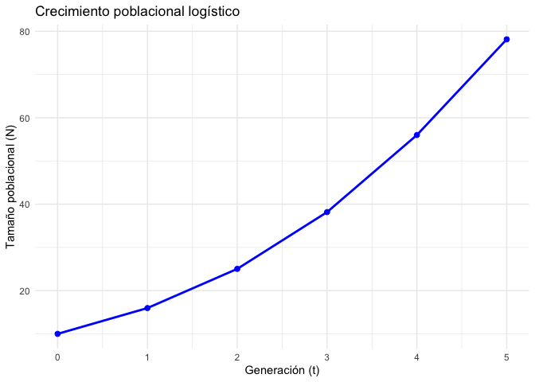
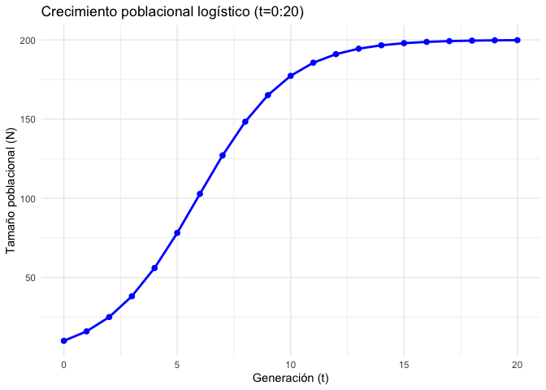
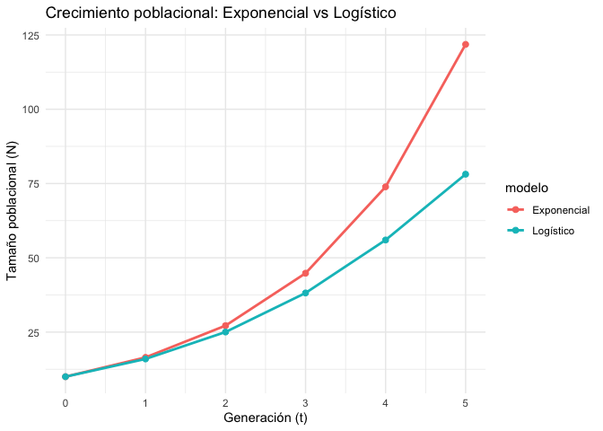
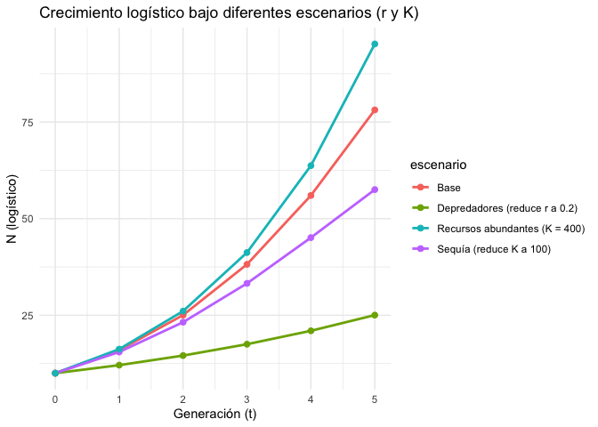
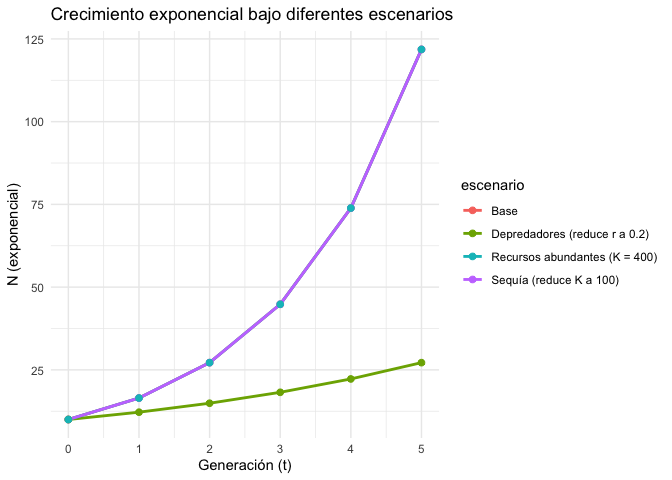
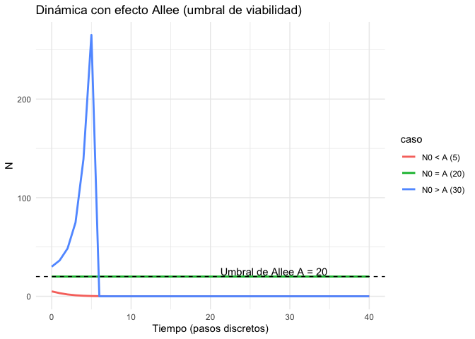

Solución propuesta 6
================

``` r
# EJERCICIO 6

## =========================================================
## Crecimiento poblacional: exponencial, logístico y escenarios
## =========================================================

library(dplyr)
```

    ## 
    ## Attaching package: 'dplyr'

    ## The following objects are masked from 'package:stats':
    ## 
    ##     filter, lag

    ## The following objects are masked from 'package:base':
    ## 
    ##     intersect, setdiff, setequal, union

``` r
library(tidyr)
library(ggplot2)

## ---------------------------
## Parámetros base (del enunciado)
## ---------------------------
N0 = 10        # tamaño inicial
r  <- 0.5       # tasa intrínseca (sin limitantes)
K  <- 200       # capacidad de carga

## Generaciones a evaluar:
## - Para "5 generaciones", normalmente calculamos t=1..5.
## - Para visualizar el estado inicial, también muestro t=0.
t <- 0:5  # cambia a 1:5 si quieres estrictamente 5 sin t=0

## ---------------------------
## Ejercicio 1: Crecimiento Exponencial
## Fórmula: N_t = N0 * exp(r*t)
## ---------------------------
df_exp <- tibble(
  t = t,
  N_exp = N0 * exp(r * t)
)

## Tabla redondeada para copiar "a mano" si lo necesitas
df_exp_tabla <- df_exp %>%
  mutate(N_exp = round(N_exp, 2))

print(df_exp_tabla)
```

    ## # A tibble: 6 × 2
    ##       t N_exp
    ##   <int> <dbl>
    ## 1     0  10  
    ## 2     1  16.5
    ## 3     2  27.2
    ## 4     3  44.8
    ## 5     4  73.9
    ## 6     5 122.

``` r
## ---------------------------
## Ejercicio 2: Crecimiento Logístico
## Fórmula: N_t = K / ( 1 + ((K - N0)/N0) * exp(-r*t) )
## ---------------------------
df_log <- tibble(
  t = t,
  N_log = K / (1 + ((K - N0) / N0) * exp(-r * t))
)
df_log_tabla <- df_log %>%
  mutate(N_log = round(N_log, 2))

print(df_log_tabla)
```

    ## # A tibble: 6 × 2
    ##       t N_log
    ##   <int> <dbl>
    ## 1     0  10  
    ## 2     1  16.0
    ## 3     2  25.0
    ## 4     3  38.2
    ## 5     4  56  
    ## 6     5  78.1

``` r
# Gráfico ggplot2
ggplot(df_log, aes(t, N_log)) +
  geom_line(linewidth = 1, color = "blue") +
  geom_point(size = 2, color = "blue") +
  labs(title = "Crecimiento poblacional logístico",
       x = "Generación (t)", y = "Tamaño poblacional (N)") +
  theme_minimal()
```

<!-- -->

``` r
# Haciendo la logística, pero con t = 0:20 para ver mejor la forma de S
t_long <- 0:20
df_log_long <- tibble(
  t = t_long,
  N_log = K / (1 + ((K - N0) / N0) * exp(-r * t_long))
)
# Grafico ggplot2
ggplot(df_log_long, aes(t, N_log)) +
  geom_line(linewidth = 1, color = "blue") +
  geom_point(size = 2, color = "blue") +
  labs(title = "Crecimiento poblacional logístico (t=0:20)",
       x = "Generación (t)", y = "Tamaño poblacional (N)") +
  theme_minimal()
```

<!-- -->

``` r
## ---------------------------
## Comparación de curvas (Exponencial vs Logístico)
## ---------------------------
df_comp <- df_exp %>%
  inner_join(df_log, by = "t") %>%
  pivot_longer(cols = c(N_exp, N_log),
               names_to = "modelo", values_to = "N") %>%
  mutate(modelo = recode(modelo,
                         N_exp = "Exponencial",
                         N_log = "Logístico"))

print(df_comp %>% mutate(N = round(N, 2)))
```

    ## # A tibble: 12 × 3
    ##        t modelo          N
    ##    <int> <chr>       <dbl>
    ##  1     0 Exponencial  10  
    ##  2     0 Logístico    10  
    ##  3     1 Exponencial  16.5
    ##  4     1 Logístico    16.0
    ##  5     2 Exponencial  27.2
    ##  6     2 Logístico    25.0
    ##  7     3 Exponencial  44.8
    ##  8     3 Logístico    38.2
    ##  9     4 Exponencial  73.9
    ## 10     4 Logístico    56  
    ## 11     5 Exponencial 122. 
    ## 12     5 Logístico    78.1

``` r
ggplot(df_comp, aes(t, N, color = modelo)) +
  geom_line(linewidth = 1) +
  geom_point(size = 2) +
  labs(title = "Crecimiento poblacional: Exponencial vs Logístico",
       x = "Generación (t)", y = "Tamaño poblacional (N)") +
  theme_minimal()
```

<!-- -->

``` r
## ---------------------------
## Factores limitantes (Tarjetas de escenario)
## - Cambios en r y/o K según la tarjeta
## ---------------------------
scenarios <- tibble::tribble(
  ~escenario,                         ~r,   ~K,
  "Base",                             0.5,  200,
  "Sequía (reduce K a 100)",          0.5,  100,
  "Depredadores (reduce r a 0.2)",    0.2,  200,
  "Recursos abundantes (K = 400)",    0.5,  400
  # añade los que necesites, por ejemplo:
  # "Control intensivo (reduce r a 0.1)", 0.1, 200
)

## Calcula exponencial y logístico para cada escenario y t
df_scen <- tidyr::expand_grid(scenarios, t = t) %>%
  mutate(
    N_exp = N0 * exp(r * t),
    N_log = K  / (1 + ((K - N0)/N0) * exp(-r * t))
  )

## Tablas por escenario (redondeadas)
df_scen_tabla <- df_scen %>%
  mutate(N_exp = round(N_exp, 2),
         N_log = round(N_log, 2))

print(df_scen_tabla)
```

    ## # A tibble: 24 × 6
    ##    escenario                   r     K     t N_exp N_log
    ##    <chr>                   <dbl> <dbl> <int> <dbl> <dbl>
    ##  1 Base                      0.5   200     0  10    10  
    ##  2 Base                      0.5   200     1  16.5  16.0
    ##  3 Base                      0.5   200     2  27.2  25.0
    ##  4 Base                      0.5   200     3  44.8  38.2
    ##  5 Base                      0.5   200     4  73.9  56  
    ##  6 Base                      0.5   200     5 122.   78.1
    ##  7 Sequía (reduce K a 100)   0.5   100     0  10    10  
    ##  8 Sequía (reduce K a 100)   0.5   100     1  16.5  15.5
    ##  9 Sequía (reduce K a 100)   0.5   100     2  27.2  23.2
    ## 10 Sequía (reduce K a 100)   0.5   100     3  44.8  33.2
    ## # ℹ 14 more rows

``` r
## Gráfico comparando escenarios para el modelo logístico (el más realista con limitantes)
ggplot(df_scen, aes(t, N_log, color = escenario)) +
  geom_line(linewidth = 1) +
  geom_point(size = 2) +
  labs(title = "Crecimiento logístico bajo diferentes escenarios (r y K)",
       x = "Generación (t)", y = "N (logístico)") +
  theme_minimal()
```

<!-- -->

``` r
## (Opcional) Gráfico de escenarios para el exponencial
ggplot(df_scen, aes(t, N_exp, color = escenario)) +
  geom_line(linewidth = 1) +
  geom_point(size = 2) +
  labs(title = "Crecimiento exponencial bajo diferentes escenarios",
       x = "Generación (t)", y = "N (exponencial)") +
  theme_minimal()
```

<!-- -->

``` r
## ---------------------------
## (Extensión opcional) Efecto Allee
## dN/dt = r * N * (1 - N/K) * (N/A - 1)
## Simulamos en tiempo discreto con paso dt
## ---------------------------
simulate_allee <- function(N0, r, K, A, steps = 40, dt = 1) {
  N <- numeric(steps + 1)
  N[1] <- N0
  for (i in 1:steps) {
    dN <- r * N[i] * (1 - N[i]/K) * (N[i]/A - 1)
    N[i + 1] <- max(0, N[i] + dN * dt)  # evitamos negativos
  }
  tibble(t = 0:steps, N = N)
}

## Ejemplos: distintos N0 respecto al umbral A
A <- 20
traj_allee <- bind_rows(
  simulate_allee(N0 = 5,  r = 0.5, K = 200, A = A)  %>% mutate(caso = "N0 < A (5)"),
  simulate_allee(N0 = 20, r = 0.5, K = 200, A = A)  %>% mutate(caso = "N0 = A (20)"),
  simulate_allee(N0 = 30, r = 0.5, K = 200, A = A)  %>% mutate(caso = "N0 > A (30)")
)

ggplot(traj_allee, aes(t, N, color = caso)) +
  geom_line(linewidth = 1) +
  geom_hline(yintercept = A, linetype = 2) +
  annotate("text", x = max(traj_allee$t)*0.7, y = A + 5,
           label = paste0("Umbral de Allee A = ", A)) +
  labs(title = "Dinámica con efecto Allee (umbral de viabilidad)",
       x = "Tiempo (pasos discretos)", y = "N") +
  theme_minimal()
```

<!-- -->
