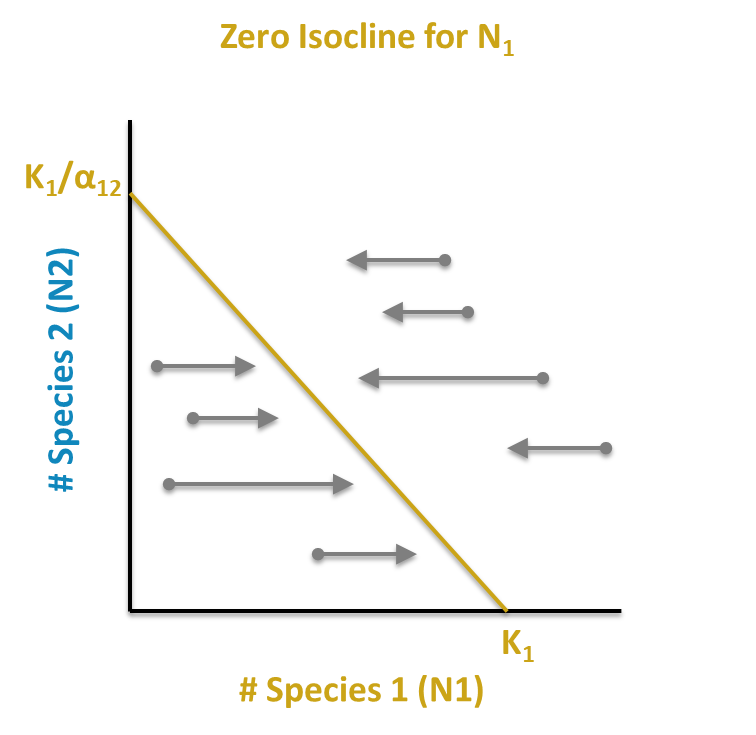
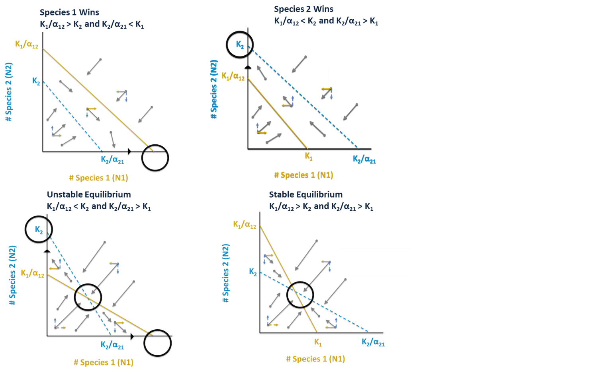

<!-- README.md se genera a partir de README.Rmd. Por favor, edita ese archivo. -->

```{css, echo=F}
.exp-box summary{
  display:inline-block; cursor:pointer;
  background:#f5f5f5; border:1px solid #ddd;
  padding:.4em .8em; border-radius:.4em; font-weight:600;
}
.exp-box[open] summary{ background:#e8f5e9; border-color:#c8e6c9; }
.exp-box .content{
  margin:.8em 0 0 0; padding:1em;
  border-left:4px solid #2E8B57; background:#fafafa;
}
.exp-box summary .label-open{ display:none; }
.exp-box[open] summary .label-closed{ display:none; }
.exp-box[open] summary .label-open{ display:inline; }
```


```{css, echo=F}
 /* Mueve el botón Show/Hide de cada chunk a la izquierda */
.code-folding-btn{
  float: left !important;
  margin: .25rem .6rem .4rem 0; /* separa del código */
}

/* Asegura que el código empiece debajo del botón */
div.sourceCode, pre {
  clear: both;
}

/* (Opcional) también mueve el botón global "Show All Code" a la izquierda */
#rmd-show-all-code{
  float: left !important;
  margin-right: .75rem;
}
```

```{css, echo=F}
/* BOTÓN COPIAR */
/* Contenedor posicionable y con espacio reservado para el botón */
.code-with-copy{
  position: relative;
  --copy-pad: 2.8rem;           /* >= altura del botón */
  padding-bottom: var(--copy-pad);  /* si .code-with-copy es div.sourceCode */
}

/* Si .code-with-copy está en el PRE, reserva ahí también */
.code-with-copy pre{
  padding-bottom: var(--copy-pad) !important;
  margin-bottom: 0 !important;
}

/* Variante pandoc: el código está dentro de div.sourceCode > pre */
.code-with-copy div.sourceCode{
  padding-bottom: var(--copy-pad);     /* reserva espacio dentro del scrolleo */
}
.code-with-copy div.sourceCode pre{
  margin-bottom: 0 !important;         /* evita doble espacio visual */
}

/* Botón "Copiar" abajo-izquierda */
.code-copy-btn{
  position: absolute;
  bottom: .6rem; left: .6rem;   /* antes top/right */
  font-size: .8rem; line-height: 1;
  padding: .35rem .55rem;
  border: 1px solid #d0d7de; border-radius: .35rem;
  background: #f6f8fa; cursor: pointer;
  z-index: 2;
}
.code-copy-btn:hover{ background:#eef2f6; }

/* (opcional) por si algún tema recorta la altura de línea */
.code-with-copy code{ line-height: 1.25; }
```

<script>
window.addEventListener('DOMContentLoaded', function () {
  // Encuentra bloques de código en ambas variantes de Pandoc
  var codeNodes = document.querySelectorAll('div.sourceCode pre code, pre > code');

  codeNodes.forEach(function(codeEl){
    // Contenedor posicionable: el div.sourceCode si existe, si no el <pre>
    var box = codeEl.closest('div.sourceCode') || codeEl.parentElement;
    if (!box) return;

    // Evita duplicados si ya existe botón
    if (box.querySelector('.code-copy-btn')) return;

    // Asegura clase para posicionamiento relativo
    box.classList.add('code-with-copy');

    // Crea botón
    var btn = document.createElement('button');
    btn.className = 'code-copy-btn';
    btn.type = 'button';
    btn.setAttribute('aria-label', 'Copiar código');
    btn.textContent = 'Copiar';
    box.appendChild(btn);

    function getCodeText() {
      // innerText preserva saltos de línea visuales
      var txt = codeEl ? codeEl.innerText : '';
      return (txt || '').replace(/\s+$/,'') + '\n';
    }

    function feedback(ok){
      var old = btn.textContent;
      btn.textContent = ok ? '¡Copiado!' : 'Error';
      btn.disabled = true;
      setTimeout(function(){ btn.textContent = old; btn.disabled = false; }, 1200);
    }

    function fallbackCopy(text){
      var ta = document.createElement('textarea');
      ta.value = text; ta.style.position = 'fixed'; ta.style.top = '-1000px';
      document.body.appendChild(ta); ta.focus(); ta.select();
      try { feedback(document.execCommand('copy')); }
      catch(e){ feedback(false); }
      document.body.removeChild(ta);
    }

    btn.addEventListener('click', function(){
      var text = getCodeText();
      if (navigator.clipboard && window.isSecureContext){
        navigator.clipboard.writeText(text).then(function(){ feedback(true); })
          .catch(function(){ fallbackCopy(text); });
      } else {
        fallbackCopy(text);
      }
    });
  });
});
</script>


```{r setup, include=FALSE}
knitr::opts_chunk$set(
  echo = TRUE,
  warning = FALSE,
  message = FALSE,
  cache = FALSE,
  out.width = '100%',
  fig.retina = 4)
generar_todos_los_graficos <- T
```

```{r, include=F}
output_format <- knitr::opts_knit$get("rmarkdown.pandoc.to")
repo_url <- system("git config --get remote.origin.url", intern = TRUE)
repo_name <- sub(".git$", "", basename(repo_url))
org_name <- basename(dirname(repo_url))
rmd_filename <- tools::file_path_sans_ext(basename(knitr::current_input()))
github_pages_url <- paste0("https://", org_name, ".github.io/", repo_name, "/", rmd_filename, "/", rmd_filename, ".html")
```

```{r, results='asis', echo=F}
if (grepl('gfm', output_format)) {
  cat('Versión HTML (quizá más legible), [aquí](', github_pages_url, ')\n', sep = '')
} else if (output_format == 'latex') {
  cat('Versión HTML (quizá más legible), [aquí](', github_pages_url, ')\n', sep = '')
}
```

```{r paquetes, include=FALSE}
suppressPackageStartupMessages({
  library(ggplot2)
  library(digest)
  library(deSolve)
})
theme_set(theme_minimal())
```

> Donde quiera que veas el botón `Show`/`Hide`, haz clic para expandir/colapsar la caja de código.

```{r}
# ESTA ES UNA CAJA DE CÓDIGO DE EJEMPLO
```


# Ejercicio 1. **Competencia interespecífica** con el modelo de **Lotka–Volterra**

> Objetivo: evaluar el tipo de competencia LV entre dos especies a partir de una tabla pequeña (10 filas) de datos simulados y sus parámetros asociados, trabajando **a mano** o con ayuda de una hoja de cálculo, y R (opcionalmente).

## Marco teórico — **Competencia interespecífica** con el modelo de **Lotka–Volterra**

**Fuente base**: *LibreTexts* — *15.5: Quantifying Competition Using the Lotka-Volterra Model* (Gettysburg College, Ecology for All). Ver sección **Referencias** al final.

### Del **logístico** de una especie a la competencia de **dos especies**

Partimos del crecimiento **logístico** para cada especie en ausencia de la otra (intraespecífica):

$$
\frac{d N_{1}}{dt}=r_{1} N_{1}\left(\frac{K_{1}-N_{1}}{K_{1}}\right),\qquad
\frac{d N_{2}}{dt}=r_{2} N_{2}\left(\frac{K_{2}-N_{2}}{K_{2}}\right).
$$

$$
\begin{aligned}
t &:\ \text{tiempo},\\[2pt]
N_1,\ N_2 &:\ \text{tamaño poblacional de las especies 1 y 2 (individuos)},\\[2pt]
\frac{dN_1}{dt},\ \frac{dN_2}{dt} &:\ \text{tasas instantáneas de cambio poblacional (individuos/tiempo)},\\[2pt]
r_1,\ r_2 &:\ \text{tasas intrínsecas de crecimiento (tiempo}^{-1}\text{)},\\[2pt]
K_1,\ K_2 &:\ \text{capacidades de carga del ambiente (individuos)},\\[2pt]
\left(\frac{K_1-N_1}{K_1}\right),\ \left(\frac{K_2-N_2}{K_2}\right) 
&:\ \text{factor densodependiente }=1-\frac{N_1}{K_1},\ 1-\frac{N_2}{K_2}.
\end{aligned}
$$

Para incorporar **competencia interespecífica**, suponemos que individuos de la especie 2 reducen el crecimiento de la 1 en **unidades equivalentes** a $\alpha_{12}$ individuos de 1 (y viceversa $\alpha_{21}$). Esto produce las **ecuaciones de Lotka–Volterra (competencia)**:

$$
\frac{dN_{1}}{dt}= r_{1}N_{1}\!\left(\frac{K_1 - N_{1} - \alpha_{12}N_{2}}{K_{1}}\right),\qquad
\frac{dN_{2}}{dt}= r_{2}N_{2}\!\left(\frac{K_2 - N_{2}-\alpha_{21}N_{1}}{K_{2}}\right).
$$

> $\alpha_{12}$ y $\alpha_{21}$ son **coeficientes de competencia** (adimensionales): convierten individuos de una especie en “**equivalentes**” de la otra en términos de uso de recursos. También se suele usar la notación $\alpha$ para $\alpha_{12}$, y $\beta$ para $\alpha_{21}$.

<details class="exp-box">
  <summary>
    <span class="label-closed">Más información</span>
    <span class="label-open">Ocultar</span>
  </summary>
  <div class="content">
Sobre el modelo logístico, construimos el modelo con competencia. Para ello, incorporamos la competencia interespecífica en cada una de estas ecuaciones. Suponemos que cada nuevo integrante de la Población 1 reduce los recursos disponibles para cada integrante de la Población 2 y, por lo tanto, disminuye su tasa de crecimiento poblacional. Del mismo modo, los nuevos integrantes de la Población 2 también reducirán los recursos disponibles para los miembros de la Población 1; eso es, en esencia, lo que significa competencia interespecífica.

La forma más simple de modelar esto sería modificar el término correspondiente al efecto de la densidad. Sin embargo, esa opción supone que cada individuo adicional de la Población 2 afecta a la Población 1 exactamente igual que lo haría un individuo adicional de la propia Población 1. Como esto no tiene por qué ser cierto, introducimos un **coeficiente de competencia** que expresa cuánto influye, en términos relativos, cada individuo adicional de la Población 2 sobre la Población 1 (comparado con el efecto de un individuo adicional de la Población 1). El modelo para la Población 2 se modifica de manera paralela. El resultado es el modelo de Lotka–Volterra para competencia entre dos especies.

Observa los subíndices de los coeficientes de competencia: el que va “de 2 a 1” expresa el efecto de un miembro de la Población 2 sobre la tasa de crecimiento de la Población 1; el que va “de 1 a 2” expresa el efecto de un miembro de la Población 1 sobre la tasa de crecimiento de la Población 2.

El valor del coeficiente de competencia nos dice algo sobre la importancia relativa de la competencia **interespecífica** frente a la **intraespecífica** en la dinámica de una especie:

* Si el coeficiente es **menor que 1**, la competencia **intraespecífica** tiene un impacto per cápita más fuerte en la disponibilidad de recursos para esa especie.
* Si el coeficiente es **mayor que 1**, la competencia **interespecífica** tiene un impacto per cápita más fuerte.
* Si el coeficiente es **igual a 1**, ambos tipos de competencia tienen un impacto per cápita similar sobre la disponibilidad de recursos para esa especie.
  </div>
</details>


### Diagrama de fase, **isoclinas** y **puntos de equilibrio**

Son líneas de crecimiento neto cero (en inglés *zero net growth isocline*, ZNGI), y se denominan así porque, a lo largo de ellas, el crecimiento de la población que representan es cero. Las isoclinas se dibujan sobre un gráfico muy conocido en ecología denominado "**diagrama de fase**" o "**plano $N_1$–$N_2$**", en el que se representan los tamaños de las dos poblaciones de manera conjunta en los ejes $N_1$ y $N_2$. El diagrama de fase **no incluye el tiempo en sus ejes**, sólo los tamaños poblacionales.

La isoclina de 1 ($dN_1/dt=0$) cumple $N_{1}+\alpha_{12}N_{2}=K_{1}$.  
La de 2 ($dN_2/dt=0$) cumple $N_{2}+\alpha_{21}N_{1}=K_{2}$.

Sus **interceptos** con los ejes son:

- Para 1: $(K_1,0)$ y $(0,K_1/\alpha_{12})$.
- Para 2: $(0,K_2)$ y $(K_2/\alpha_{21},0)$.

El **cruce** de isoclinas en el diagrama de fase da el equilibrio interior $(N_1^{*},N_2^{*})$, pero este no siempre existe. Cuando las isoclinas no se cruzan, el escenario es de exclusión; existe un escenario donde las isoclinas se intersectan en el que también se produce exclusión. Para determinar a qué escenario corresponde nuestro modelo, se evalúan los interceptos en el diagrama de fase:

- **1 excluye 2** si $K_1 > K_2/\alpha_{21}$ **y** $K_2 < K_1/\alpha_{12}$.
- **2 excluye 1** si $K_1 < K_2/\alpha_{21}$ **y** $K_2 > K_1/\alpha_{12}$.
- **Coexistencia (equilibrio) inestable** si $K_1 > K_2/\alpha_{21}$ **y** $K_2 > K_1/\alpha_{12}$, donde se pueden presentar condiciones también de exclusión en función de las condiciones iniciales.
- **Coexistencia (equilibrio) estable** si $K_1 < K_2/\alpha_{21}$ **y** $K_2 < K_1/\alpha_{12}$, y es el único caso donde ambas especies se encuentran en equilibrio.

**Lectura visual** del diagrama de fase o plano $N_1$–$N_2$:

- Debajo o a la izquierda de la isoclina de una especie, su población **crece** ($dN_i/dt>0$); por encima o la derecha de la isoclina de una especie, su población **disminuye**.
- Si las isoclinas no se intersectan, una especie excluye a la otra (extinción local de una especie). En concreto, la especie cuya isoclina se encuentre más a la derecha-arriba será la especie que "vencerá".
- Si hay intersección de las isoclinas, y las flechas del campo apuntan hacia dicha intersección, hay **coexistencia estable**; pero si aún habiendo intersección, las flechas del campo “caen” hacia un **eje**, se dice que hay **exclusión** (extinción local de una especie).


<details class="exp-box">
  <summary>
    <span class="label-closed">Más información</span>
    <span class="label-open">Ocultar</span>
  </summary>
  <div class="content">
  
**Qué son las isoclinas y qué “dicen”**

* **Isoclina de $N_1$**: $N_1 + \alpha_{12}N_2 = K_1$.
  Debajo/izquierda de esa línea se cumple $N_1+\alpha_{12}N_2<K_1$ ⇒ $dN_1/dt>0$ (1 **aumenta**).
  Encima/derecha, $dN_1/dt<0$ (1 **disminuye**).
* **Isoclina de $N_2$**: $N_2 + \alpha_{21}N_1 = K_2$.
  Debajo/izquierda de esa línea: $dN_2/dt>0$ (2 **aumenta**).
  Encima/derecha: $dN_2/dt<0$ (2 **disminuye**).

Cada isoclina “parte” el diagrama de fase en dos mitades: donde esa especie crece o decrece.

**Qué significa “converge a la intersección → coexistencia”**

El **único** punto del interior donde **ambas** derivadas son cero a la vez es el **cruce de isoclinas**.
Si las flechas del campo (al combinar los signos de $dN_1$ y $dN_2$) apuntan **hacia** ese cruce desde los alrededores, **ese punto es estable**: las dos poblaciones se acercan a $(N_1^*,N_2^*)$. Eso es **coexistencia estable**.

Regla visual rápida:

* Zona “debajo” de ambas isoclinas: flecha ↗︎ (suben las dos).
* “Debajo” de la de $N_1$ pero “encima” de la de $N_2$: 1 sube, 2 baja → flecha →.
* “Encima” de la de $N_1$ pero “debajo” de la de $N_2$: 1 baja, 2 sube → flecha ↑.
* “Encima” de ambas: flecha ↙︎ (bajan las dos).

Si esas flechas rodean el cruce y lo “atrapan”, hay coexistencia estable.

**Qué significa “cae a un eje → exclusión”**

En el diagrama de fase o plano $N_1$-$N_2$, los ejes $N_1=0$ (abajo, horizontal) y $N_2=0$ (izquierda, vertical) representan **extinción** de una especie.

* En el eje $N_2=0$: la ecuación de $N_2$ vale 0 para siempre ⇒ si la trayectoria llega ahí, **2 queda extinta** y 1 evoluciona sola (logístico) hasta $(K_1,0)$.
* En el eje $N_1=0$: análogo, ⇒ la especie **1 queda extinta** y 2 evoluciona sola hasta alcanzar $(0,K_2)$.

Por eso, cuando una trayectoria el diagrama de fase “**cae a un eje**”, significa que una especie se **va a 0**, y esto significa **exclusión competitiva**.

**Analiza el caso “2 excluye a 1” mirando un diagrama de fase** (ver gráfico superior-derecha de \@ref(casos-canonicos))

En el diagrama de fase, mira los **interceptos** de las isoclinas en los ejes:

* En el **eje $N_1$** (abajo): compara $K_1$ (corte de la isoclina de 1) con $K_2/\alpha_{21}$ (corte de la isoclina de 2).
* En el **eje $N_2$** (izquierda): compara $K_1/\alpha_{12}$ (corte de la isoclina de 1) con $K_2$ (corte de la de 2).

Casos clásicos (geométricos):

* **2 excluye a 1** si la isoclina de 2 queda **más “afuera”** que la de 1 en **ambos ejes**:
  $K_1 < K_2/\alpha_{21}$ **y** $K_1/\alpha_{12} < K_2$.
  Intuición: 2 “tolera” más densidad propia y del otro (la intra > inter para 2); las flechas empujan hacia el **eje $N_1=0$** ⇒ $N_1\to0$.
* **1 excluye a 2** si pasa lo contrario (isoclina de 1 más afuera en ambos ejes).
* **Cruce “alternado”** (uno gana en $x$ y el otro en $y$): hay cruce interior.

  * Si **intra > inter** para ambos (geométricamente: el cruce resulta **atractor**), hay **coexistencia estable**.
  * Si **inter > intra** (el cruce es **inestable**), hay "punto de silla" (*saddle point*), separatriz y **efecto de prioridad**: según condiciones iniciales, uno u otro excluye.

> Importante: **siempre hay un cruce geométrico** de las líneas con parámetros positivos. Lo que cambia no es “si hay cruce”, sino **si ese cruce es estable o inestable**. La exclusión **puede ocurrir aunque las isoclinas se crucen**, en cuyo caso el cruce es un punto de separación o repulsión de las flechas de campo  denominado "punto de silla" (*saddle point*), y las flechas se van a un eje. También se menciona el concepto de separatriz, una línea dibujadada sobre el punto de silla, la cual divide el diagrama de fase en dos zonas: si las condiciones iniciales están a un lado de la separatriz, una especie excluye a la otra; si están al otro lado, ocurre lo contrario. En este caso, el resultado final depende de las **condiciones iniciales** (efecto de prioridad).

**Cómo leer el diagrama de fase, paso a paso (receta rápida en clase)**

1. Dibuja los dos cortes en cada eje ($K_1$ vs $K_2/\alpha_{21}$; $K_1/\alpha_{12}$ vs $K_2$).
2. Marca qué regiones son $dN_1/dt>0$ (debajo de su isoclina) y $dN_2/dt>0$ (debajo de la suya).
3. Dibuja 3–4 flechas guía en cada región.
4. Si las flechas **entran** al cruce ⇒ **coexistencia**.
   Si las flechas **salen** del cruce y terminan en un eje ⇒ **exclusión** (la especie del eje opuesto se extingue).
  </div>
</details>

#### **Diagramas de fase de referencia según las disposición de las isoclinas**

##### **Isoclina de la población 1**

```{r, out.width='40%', echo=F}

```
<br>

---

##### **Isoclina de la población 2**

```{r, out.width='40%', echo=F}
knitr::include_graphics("isoclina-cero-n2.png")
```
<br>

---

##### **Los cuatro casos canónicos de competencia LV** {#casos-canonicos}

```{r, out.width='80%', echo=F}

```
<br>

---

##### **Los dos casos de competencia LV con coexistencia: estable vs. inestable**

```{r, out.width='80%', echo=F}
#| label: lv-panels
#| fig.width: 7.2
#| fig.height: 8

suppressPackageStartupMessages({
  library(ggplot2)
  suppressWarnings(try(library(patchwork), silent = TRUE))
})

plot_lv_panel <- function(K1, K2, a12, a21, titulo = ""){

  # Interceptos de cada isoclina
  xint_N1iso <- K1                 # (K1, 0)
  yint_N1iso <- K1 / a12           # (0, K1/a12)
  xint_N2iso <- K2 / a21           # (K2/a21, 0)
  yint_N2iso <- K2                 # (0, K2)

  # Límites que contienen todos los interceptos
  x_max <- 1.05 * max(xint_N1iso, xint_N2iso)
  y_max <- 1.05 * max(yint_N1iso, yint_N2iso)

  # Malla para sombreado por signos
  nx <- 200; ny <- 200
  grid <- expand.grid(N1 = seq(0, x_max, length.out = nx),
                      N2 = seq(0, y_max, length.out = ny))
  grid$dN1 <- (K1 - (grid$N1 + a12*grid$N2)) * grid$N1  # el signo no depende de r1/K1
  grid$dN2 <- (K2 - (grid$N2 + a21*grid$N1)) * grid$N2  # idem
  grid$region <- with(grid,
                      ifelse(dN1>0 & dN2>0, "++ (↑1, ↑2)",
                      ifelse(dN1>0 & dN2<0, "+- (↑1, ↓2)",
                      ifelse(dN1<0 & dN2>0, "-+ (↓1, ↑2)",
                                         "-- (↓1, ↓2)"))))
  grid$region <- factor(grid$region,
                        levels = c("++ (↑1, ↑2)", "+- (↑1, ↓2)",
                                   "-+ (↓1, ↑2)", "-- (↓1, ↓2)"))

  # Isoclinas: segmentos sólo entre interceptos
  n1_seg <- seq(0, xint_N2iso, length.out = 600)         # para N2-iso: variar N1
  n2_iso <- pmax(0, K2 - a21*n1_seg)
  n2_seg <- seq(0, yint_N1iso, length.out = 600)         # para N1-iso: variar N2
  n1_iso <- pmax(0, K1 - a12*n2_seg)

  df_iso <- rbind(
    data.frame(N1 = n1_iso, N2 = n2_seg, iso = "Isoclina N1 (dN1/dt = 0)"),
    data.frame(N1 = n1_seg, N2 = n2_iso, iso = "Isoclina N2 (dN2/dt = 0)")
  )

  # Punto de intersección (si cae en el primer cuadrante)
  den <- 1 - a12*a21
  N1_star <- (K1 - a12*K2) / den
  N2_star <- (K2 - a21*K1) / den
  show_star <- is.finite(N1_star) && is.finite(N2_star) &&
               N1_star > 0 && N2_star > 0 &&
               N1_star <= x_max && N2_star <= y_max
  star_df <- if (show_star) data.frame(N1 = N1_star, N2 = N2_star) else NULL

  # Etiquetas de interceptos
  pts_iso <- data.frame(
    N1  = c(xint_N1iso, 0,            0,           xint_N2iso),
    N2  = c(0,          yint_N1iso,   yint_N2iso,  0),
    lab = c("K[1]", "K[1]/alpha[12]", "K[2]", "K[2]/alpha[21]")
  )

  ggplot() +
    geom_raster(data = grid, aes(N1, N2, fill = region), alpha = 0.35, interpolate = TRUE) +
    scale_fill_manual(values = c("++ (↑1, ↑2)" = "#9BD77A",
                                 "+- (↑1, ↓2)" = "#7FC8F8",
                                 "-+ (↓1, ↑2)" = "#FFCF7C",
                                 "-- (↓1, ↓2)" = "#D6B3E6"),
                      name = "Regiones") +
    geom_path(data = df_iso, aes(N1, N2, color = iso, linetype = iso), linewidth = 1.25) +
    scale_color_manual(values = c("Isoclina N1 (dN1/dt = 0)" = "#E69138",   # N1: sólido
                                  "Isoclina N2 (dN2/dt = 0)" = "#3C78D8"),  # N2: punteada
                       name = NULL) +
    scale_linetype_manual(values = c("Isoclina N1 (dN1/dt = 0)" = "solid",
                                     "Isoclina N2 (dN2/dt = 0)" = "22"),
                          name = NULL) +
    geom_point(data = pts_iso, aes(N1, N2),
               shape = 21, size = 3, stroke = 1,
               fill = "grey60", color = "white") +
    geom_text(data = pts_iso, aes(N1, N2, label = lab), parse = TRUE,
              nudge_x = 0.02*max(x_max, y_max),
              nudge_y = 0.02*max(x_max, y_max),
              size = 3.4) +
    { if (show_star) geom_point(data = star_df, aes(N1, N2),
                                shape = 21, size = 3, stroke = 1,
                                fill = "black", color = "white") } +
    coord_cartesian(xlim = c(0, x_max), ylim = c(0, y_max), expand = TRUE) +
    labs(title = titulo, x = "N1", y = "N2") +
    theme_minimal(base_size = 12) +
    theme(legend.position = "right",
          legend.box.margin = margin(2, 2, 2, 2))
}

# --- Parámetros de ejemplo ---
# Inestable (inter > intra para ambas): K1/a12 < K2  y  K2/a21 < K1
p_inest <- plot_lv_panel(K1 = 600, K2 = 500, a12 = 1.4, a21 = 1.3,
                         titulo = "Equilibrio multispecífico INESTABLE")

# Estable (intra > inter para ambas): K1/a12 > K2  y  K2/a21 > K1
p_estab <- plot_lv_panel(K1 = 600, K2 = 500, a12 = 0.6, a21 = 0.5,
                         titulo = "Equilibrio multispecífico ESTABLE")

# Mostrar en dos paneles (usa 'patchwork' si está disponible)
if ("patchwork" %in% (.packages())) {
  p_inest / p_estab
} else {
  print(p_inest); print(p_estab)
}
```

---

### Trayectorias 

**Qué es una trayectoria.**
Llamaremos **trayectoria** a la curva $(N_1(t),N_2(t))$ que sigue el sistema en el plano $N_1$–$N_2$ desde unas **condiciones iniciales** dadas $(N_1(0),N_2(0))$. Cada punto del plano lleva asociada una **flecha** (el **campo de vectores**) que indica la dirección del cambio instantáneo $(\dot N_1,\dot N_2)$; la trayectoria “sigue” esas flechas.

**Cómo se mueve la trayectoria respecto de las isoclinas.**

* En la **isoclina de $N_1$** (donde $\dot N_1=0$), la componente horizontal del movimiento es cero: la trayectoria allí sólo se desplaza **verticalmente** (según el signo de $\dot N_2$).
* En la **isoclina de $N_2$** (donde $\dot N_2=0$), la componente vertical es cero: la trayectoria allí sólo se desplaza **horizontalmente** (según el signo de $\dot N_1$).
* Fuera de las isoclinas, el **signo** de $\dot N_1$ y $\dot N_2$ (según qué lado de cada isoclina estés) determina si la flecha apunta ↗︎, ↘︎, ↖︎ o ↙︎.

**Hacia dónde va una trayectoria.**

* Si las flechas **entran** al cruce de isoclinas, las trayectorias **convergen** al equilibrio interior $(N_1^*,N_2^*)$ ⇒ **coexistencia estable**.
* Si el cruce es **inestable**, el punto de intersección de las isoclinas se denomina "punto de silla" y, sobre éste, se dibuja una "**separatriz**" (frontera) que divide los estados iniciales en dos **cuencas de atracción**: a un lado, la trayectoria “cae” hacia el eje $N_2=0$ $(K_1,0)$ ⇒ **1 excluye 2**; al otro lado, hacia $N_1=0$ $(0,K_2)$ ⇒ **2 excluye 1**.
* Si la trayectoria llega a un **eje**, la especie correspondiente se mantiene en 0 y la otra sigue su **logístico** hasta su $K$.

**Cómo leer una trayectoria (receta rápida).**

1. Marca los **cuatro interceptos** de las isoclinas (dos por isoclina) y dibuja ambas rectas.
2. Determina el **signo** de $(\dot N_1,\dot N_2)$ en cada región (debajo/encima de cada isoclina).
3. Sitúa tu **punto inicial** y sigue el **campo de flechas**; si tocas la isoclina de $N_1$, justo después te moverás **verticalmente** hasta tocar la isoclina de $N_2$, y repite; si tocas la de $N_2$, te moverás **horizontalmente** hasta tocar la isoclina de $N_1$, y repite.
4. Si te acercas al cruce ⇒ **coexistencia estable**; si te alejas hacia un eje ⇒ **coexistencia inestable o exclusión**.


```{r trayectoria-demo, fig.width=10, fig.height=10, echo=F}
# Demostración visual: trayectorias en dos escenarios canónicos
# (coexistencia estable vs. coexistencia inestable)

suppressPackageStartupMessages(library(deSolve))

phase_plot <- function(K1,K2,r1,r2,a12,a21, ttl){
  # Interceptos de isoclinas
  xint_N1 <- K1
  yint_N1 <- K1/a12
  xint_N2 <- K2/a21
  yint_N2 <- K2
  x_max <- 1.05*max(xint_N1, xint_N2)
  y_max <- 1.05*max(yint_N1, yint_N2)

  # Campo de vectores
  nx <- 16; ny <- 16
  grd <- expand.grid(N1 = seq(0, x_max, length.out=nx),
                     N2 = seq(0, y_max, length.out=ny))
  grd$dN1 <- r1*grd$N1*(1 - (grd$N1 + a12*grd$N2)/K1)
  grd$dN2 <- r2*grd$N2*(1 - (grd$N2 + a21*grd$N1)/K2)
  L <- sqrt(grd$dN1^2 + grd$dN2^2); L[L==0] <- 1e-9
  s <- 0.06*max(x_max, y_max)
  grd$xend <- grd$N1 + s*(grd$dN1/L)
  grd$yend <- grd$N2 + s*(grd$dN2/L)

  # Isoclinas (entre interceptos)
  n1seg <- seq(0, xint_N2, length.out=500)
  n2iso <- pmax(0, K2 - a21*n1seg)
  n2seg <- seq(0, yint_N1, length.out=500)
  n1iso <- pmax(0, K1 - a12*n2seg)
  iso <- rbind(
    data.frame(N1=n1iso, N2=n2seg, iso="Isoclina N1 (dN1/dt = 0)"),
    data.frame(N1=n1seg, N2=n2iso, iso="Isoclina N2 (dN2/dt = 0)")
  )

  # ODE
  lv <- function(t,y,p){
    with(as.list(p), {
      N1 <- y[1]; N2 <- y[2]
      dN1 <- r1*N1*(1 - (N1 + a12*N2)/K1)
      dN2 <- r2*N2*(1 - (N2 + a21*N1)/K2)
      list(c(dN1, dN2))
    })
  }

  # Varias trayectorias desde condiciones iniciales diversas
  inits <- expand.grid(N1 = seq(0.1*x_max, 0.9*x_max, length.out=4),
                       N2 = seq(0.1*y_max, 0.9*y_max, length.out=3))
  trs <- do.call(rbind, lapply(seq_len(nrow(inits)), function(i){
    y0 <- c(N1=inits$N1[i], N2=inits$N2[i])
    out <- as.data.frame(ode(y=y0, times=seq(0, 120, by=0.5),
                             func=lv,
                             parms=list(r1=r1,r2=r2,K1=K1,K2=K2,a12=a12,a21=a21)))
    cbind(out, id=i)
  }))

  # Plot
  ggplot() +
    geom_segment(data=grd, aes(x=N1,y=N2,xend=xend,yend=yend),
                 arrow = arrow(length = grid::unit(2.5,"pt")),
                 linewidth=0.25, alpha=0.85) +
    geom_path(data=iso, aes(N1, N2, color=iso, linetype=iso),
              linewidth=1.05) +
    scale_color_manual(values=c("Isoclina N1 (dN1/dt = 0)"="#E69138",
                                "Isoclina N2 (dN2/dt = 0)"="#3C78D8"), name=NULL) +
    scale_linetype_manual(values=c("Isoclina N1 (dN1/dt = 0)"="solid",
                                   "Isoclina N2 (dN2/dt = 0)"="22"), name=NULL) +
    geom_path(data=trs, aes(N1,N2, group=id),
              color="#2E8B57", linewidth=0.9, alpha=0.9) +
    coord_cartesian(xlim=c(0,x_max), ylim=c(0,y_max), expand=TRUE) +
    labs(title=ttl, x="N1", y="N2") +
    theme_minimal() +
    theme(legend.position="bottom")
}

# Escenarios:
# (A) Coexistencia estable: K1 < K2/a21 y K2 < K1/a12
p_estable <- phase_plot(K1=600, K2=500, r1=0.6, r2=0.55, a12=0.9, a21=0.6,
                          ttl="(A) Coexistencia estable: las trayectorias\n convergen hacia la intersección de las isoclinas\n")
# (B) Coexistencia inestable: K1 > K2/a21 y K2 > K1/a12
p_inestable <- phase_plot(K1=600, K2=500, r1=0.6, r2=0.55, a12=1.55, a21=1.25,
                        ttl="(B) Coexistencia inestable (separatriz no dibujada):\n las trayectorias convergen se dirigen hacia las isoclinas,\n pero luego buscan el eje horizontal hasta K1 (1 excluye a 2),\n o el eje vertical hasta K2 (2 excluye a 1)")
```


```{r trayectoria-demo-imp1, out.width='70%', fig.asp=1, echo=F}
print(p_estable)
```

<br>
<br>

```{r trayectoria-demo-imp2, out.width='70%', fig.asp=1, echo=F}
print(p_inestable)
```

**Qué ver en el gráfico:**

* En **(A)** las trayectorias de distintos puntos iniciales **entran** al cruce de isoclinas ⇒ **coexistencia estable**.
* En **(B)** hay dos destinos posibles (hacia $(K_1,0)$ o $(0,K_2)$), separados por una **frontera** (separatriz) ⇒ **coexistencia inestable** con **efecto de prioridad**: el resultado depende del lado en que caiga el estado inicial.


### **Exclusión competitiva**

> **Definición operativa**: **exclusión competitiva** significa que, bajo condiciones constantes, **una especie reduce a la otra hasta densidad ≈ 0 en esa comunidad** (*extinción local*). Coloquialmente: “**1 saca a 2 del sitio**”. No implica extinción global; la especie excluida puede persistir en otro hábitat o volver por inmigración.

En el **modelo de Lotka–Volterra**:

- Decimos **“1 excluye a 2”** cuando la trayectoria termina en $(K_1,0)$: la población 2 cae sobre el **eje horizontal, donde $N_2=0$** y no se recupera  (ver gráfico superior-izquierda en sección \@ref(#casos-canonicos)).

- Decimos **“2 excluye a 1”** cuando la trayectoria termina en $(0,K_2)$: la población 1 cae sobre el **eje vertical, donde $N_1=0$** y no se recupera (ver gráfico superior-derecha en sección \@ref(#casos-canonicos)).


- **Lectura del diagrama de fase o plano $N_1$–$N_2$**:

  - Si las **flechas** del campo llevan hacia el eje horizontal, donde $N_2=0$, **2 se extingue localmente, es decir, 1 excluye a 2** (ver gráfico superior-izquierda en sección \@ref(#casos-canonicos)).
  - Si la flechas llevan al eje vertical, donde $N_1=0$, la excluida es **1** (ver gráfico superior-derecha en sección \@ref(#casos-canonicos)).

- **¿Cuándo ocurre exclusión competitiva?**: cuando la **competencia interespecífica** sobre la especie perdedora es tan fuerte que su crecimiento es **negativo** frente a la otra, incluso a bajas densidades.  
- **¿Cuándo no ocurre exclusión competitiva?**: con **partición de nicho**, **variación ambiental**, **heterogeneidad espacial** o **rescate por inmigración**, la coexistencia puede mantenerse.

## Práctica — **Competencia LV**

> **Importante**: Cada estudiante trabaja el **mismo mandato** pero con **datos distintos** y **pequeños** (10 filas) para poder **hacerlo a mano**. Se generan a partir de un **pseudónimo** (“Est01”, “Est02”, …).

### Preparación y **pseudónimo**

Copia y pega este código en RStudio y ejecútalo (para ver el código haz clic en `Show`).


```{r prep}
# Paquetes usados
suppressPackageStartupMessages({
  library(ggplot2)
  library(digest)
})

# Lista ejemplo (puedes sustituir por la de clase)
if (!exists("pseudonimos_clase")){
  pseudonimos_clase <- paste0("Est", sprintf("%02d", 1:30))
}
```

Esta es la lista de pseudónimos.

```{r prep2, results='asis'}
cat("Pseudónimos: ", paste(pseudonimos_clase[-1], collapse=", "), "\n")
```

En el código siguiente, cambia la cadena de caracteres "Est01" por tu pseudónimo (p. ej. "Est05"). Esto genera tus datos **únicos** y **reproducibles**. Anuncia tu elección en el foro.

```{r prep3}
# Elige tu pseudónimo
MI_PSEUDONIMO <- "Est01"  # <-- CAMBIA AQUÍ
```

### Generador de datos **reproducibles**

Este es el código que genera la tabla de datos (10 filas) y los parámetros para trabajar **a mano**. Recuerda que para que este código produzca tus datos, debes haber ejecutado el bloque anterior con tu pseudónimo.

```{r generador}
seed_from_name <- function(x){
  # hash a 32 bits reproducible
  hx <- tryCatch(digest::digest(x, algo="xxhash64", serialize=FALSE),
                 error=function(e) digest::digest(x, algo="crc32", serialize=FALSE))
  by <- vapply(seq(1, 8, 2), function(i) strtoi(substr(hx, i, i+1), 16L), numeric(1))
  u32 <- sum(by * c(1,256,65536,16777216))
  as.integer(1 + (u32 %% (.Machine$integer.max - 1)))
}

# Generador competencia LV con tabla pequeña (~10 filas) para trazo a mano
gen_competencia_lv <- function(seed, steps_small=10, steps_traj=300, dt=0.05){
  set.seed(seed + 501)
  K1 <- sample(seq(320, 680, by=20), 1)
  K2 <- sample(seq(280, 640, by=20), 1)
  r1 <- runif(1, 0.35, 0.9)
  r2 <- runif(1, 0.35, 0.9)
  a12 <- runif(1, 0.2, 1.1)
  a21 <- runif(1, 0.2, 1.1)

  # Forzar 4 escenarios variados según semilla
  caso <- (seed %% 4) + 1
  if (caso == 1){ a12 <- max(0.2, a12 * 0.8); a21 <- min(1.1, a21 * 1.2) }      # 1 excluye 2
  if (caso == 2){ a12 <- min(1.1, a12 * 1.2); a21 <- max(0.2, a21 * 0.8) }      # 2 excluye 1
  if (caso == 3){ a12 <- a12 * 0.95; a21 <- a21 * 0.95 }                         # coexistencia estable
  if (caso == 4){ a12 <- a12 * 1.05; a21 <- a21 * 1.05 }                         # coexistencia inestable

  euler <- function(N10,N20,steps,dt){
    N1 <- N2 <- numeric(steps); N1[1] <- N10; N2[1] <- N20
    for (t in 2:steps){
      dN1 <- r1*N1[t-1]*(1 - (N1[t-1] + a12*N2[t-1])/K1)
      dN2 <- r2*N2[t-1]*(1 - (N2[t-1] + a21*N1[t-1])/K2)
      N1[t] <- max(0, N1[t-1] + dN1*dt)
      N2[t] <- max(0, N2[t-1] + dN2*dt)
    }
    data.frame(t = 0:(steps-1)*dt, N1=N1, N2=N2)
  }

  N10 <- round(runif(1, 0.15, 0.85)*K1)
  N20 <- round(runif(1, 0.15, 0.85)*K2)
  traj <- euler(N10, N20, steps_traj, dt)

  # Submuestreo para tabla pequeña (10 puntos) y redondeo
  take <- unique(round(seq(1, nrow(traj), length.out = steps_small)))
  small <- traj[take, c("t","N1","N2")]
  rnd5 <- function(x) 5*round(x/5)
  small$N1 <- rnd5(small$N1); small$N2 <- rnd5(small$N2)

  pars <- c(r1=r1,r2=r2,K1=K1,K2=K2,a12=a12,a21=a21,caso=caso,N10=N10,N20=N20)
  list(data_traj=traj, data_small=small, pars=pars)
}

SEED <- seed_from_name(MI_PSEUDONIMO)
comp <- gen_competencia_lv(SEED)
```

### **Tabla y parámetros**

```{r tabla-pequena, results='asis'}
knitr::kable(comp$data_small, row.names = F,
             caption="Competencia LV — tabla de 10 filas para realizar tu ejercicio a mano. El código original produce la tabla del Est01. Recuerda que para que este código produzca tu tabla, debes haber elegido y ejecutado el bloque correspondiente con tu pseudónimo.")
knitr::kable(as.data.frame(comp$pars),
             caption="Competencia LV — parámetros. El código original produce la tabla del Est01. Recuerda que para que este código produzca tu tabla, debes haber elegido y ejecutado el bloque correspondiente con tu pseudónimo.",
             col.names=c("Parámetro","Valor"))
```

### **Desarrolla este ejercicio a mano o con ayuda de una hoja de cálculo con tus datos**

> Ver demostración en la sección \@ref(sec-demo-manual-est01)

0. Recuerda que debes **ejecutar los bloques de código anteriores, y cambiar por tu pseudónimo en el bloque correspondiente** para que el código produzca tus datos.
1. **Calcula** los **interceptos** de las isoclinas y **anótalos** (1 decimal):
   - Isoclina de 1: $(K_1,0)$ y $(0,K_1/\alpha_{12})$.
   - Isoclina de 2: $(0,K_2)$ y $(K_2/\alpha_{21},0)$.
2. **Dibuja a mano** ambas isoclinas en el plano $N_1$–$N_2$ y **sombrea** las 4 regiones por signos de $(dN_1/dt,\ dN_2/dt)$: `++`, `+-`, `-+`, `--`.
3. **Coloca** los 10 puntos de tu tabla en el plano $N_1$-$N_2$ (en orden de $t$) y **traza** la trayectoria.
4. **Diagnostica** el resultado (**coexistencia estable / inestable / exclusión 1 / exclusión 2**) **argumentando** con los interceptos y el sombreado.
5. **Verifica el signo** de $dN_1/dt$ y $dN_2/dt$ en un punto de **cada región**. Elige $(n_1,n_2)$ de referencia y evalúa los signos.

### **Demostración manual, usando datos de *Est01*** {#sec-demo-manual-est01}

**Parámetros de *Est01***
$r_1=0.7363,\; r_2=0.8316,\; K_1=420,\; K_2=620,\; \alpha_{12}=0.517814,\; \alpha_{21}=0.9469748$

#### **Calcula los interceptos** de las isoclinas (anota a 1 decimal)

Modelo LV de competencia:

$$
\frac{dN_1}{dt}=r_1N_1\!\left(\frac{K_1 - N_1 - \alpha_{12}N_2}{K_1}\right),\qquad
\frac{dN_2}{dt}=r_2N_2\!\left(\frac{K_2 - N_2 - \alpha_{21}N_1}{K_2}\right).
$$

Isoclinas (líneas de crecimiento cero):

* **Isoclina de 1** ($dN_1/dt=0$): $N_1=K_1-\alpha_{12}N_2$
  Interceptos: $(K_1,0)=(\mathbf{420.0},0)$ y $(0,K_1/\alpha_{12})=(0,\mathbf{811.1})$
  (cálculo: $420/0.517814=811.102\rightarrow \mathbf{811.1}$)
* **Isoclina de 2** ($dN_2/dt=0$): $N_2=K_2-\alpha_{21}N_1$
  Interceptos: $(0,K_2)=(0,\mathbf{620.0})$ y $(K_2/\alpha_{21},0)=(\mathbf{654.7},0)$
  (cálculo: $620/0.9469748=654.716\rightarrow \mathbf{654.7}$)

**En una hoja de cálculo (opcional):** con celdas `K1=420`, `K2=620`, `a12=0.517814`, `a21=0.9469748`
`=K1/a12` → **811.1**; `=K2/a21` → **654.7**.


#### **Fija escalas de ejes** para que entren todos los interceptos

Usa límites algo superiores al mayor intercepto de cada eje:

* Horizontal $x_{\max}\approx 1.1\times \max(K_1,\;K_2/\alpha_{21})=1.1\times 654.7\approx \mathbf{720}$.
* Vertical $y_{\max}\approx 1.1\times \max(K_2,\;K_1/\alpha_{12})=1.1\times 811.1\approx \mathbf{900}$.

Traza ejes $N_1$ (0…720) y $N_2$ (0…900). Rejilla cómoda: pasos de 50.


#### **Dibuja las isoclinas**

Con lápiz, papel y regla, o en una hoja de cálculo usando un gráfico de dispersión (*XY Scatterplot*), dibuja las isoclinas.

* **Isoclina N1** (**sólida**, p.ej. naranja): une $(\mathbf{420},0)$ con $(0,\mathbf{811.1})$.
  Etiqueta: *Isoclina N1 (dN1/dt = 0)*.
* **Isoclina N2** (**punteada**, p.ej. azul): une $(0,\mathbf{620})$ con $(\mathbf{654.7},0)$.
  Etiqueta: *Isoclina N2 (dN2/dt = 0)*.

**En hoja de cálculo:** crea dos series con esos dos puntos por línea → Gráfico de **Dispersión con líneas**. Formatea N1 **sólida** y N2 **discontinua**.

#### **Sombréa las 4 regiones** por signos de $(dN_1/dt,\ dN_2/dt)$

Regla memotécnica: **debajo** de una isoclina esa especie **crece**; **encima**, **disminuye**.

* Debajo de ambas → **`++`** (suben 1 y 2).
* Debajo de N1 y **encima** de N2 → **`+-`** (1 sube, 2 baja).
* **Encima** de N1 y debajo de N2 → **`-+`** (1 baja, 2 sube).
* Encima de ambas → **`--`** (bajan 1 y 2).

Sombrea suavemente o escribe los símbolos en cada zona.

#### **Traza tu trayectoria** con la **tabla pequeña** de Est01

Tus 10 puntos $(N_1,N_2)$:

$$
(325,365)\to(275,355)\to(255,365)\to\cdots\to(205,420)
$$

Colócalos en orden de $t$ y **únelos con flechas** para indicar el sentido temporal.

> Observación de Est01: del primer al segundo punto $N_1\downarrow$ y $N_2\downarrow$ (zona `--`), luego $N_1\downarrow$ y $N_2\uparrow$ (zona `-+`), con flechas **hacia arriba–izquierda** (tendencia al eje $N_1=0$).


#### **Verificación del signo** en 4 puntos

Evalúa el paréntesis de cada derivada para las cuatro regiones posibles del diagrama $N_1$-$N_2$. No necesitas calcular valores exactos de $dN_1/dt$ y $dN_2/dt$, solo su **signo** (positivo o negativo) en un punto de referencia en cada región, utilizando como criterio la comparación del $N_i$ obtenido respecto del $K_i$ de la población:

$$
dN_1/dt\propto\Big(1-\frac{N_1+\alpha_{12}N_2}{K_1}\Big),\qquad
dN_2/dt\propto\Big(1-\frac{N_2+\alpha_{21}N_1}{K_2}\Big).
$$

Ejemplos con *Est01* ($\alpha_{12}=0.517814,\ \alpha_{21}=0.9469748,\ K_1=420,\ K_2=620$):

* **`++`** en $(100,100)$:
  * $100+0.5178\cdot100=151.8<420\Rightarrow dN_1>0$
  * $100+0.9470\cdot100=194.7<620\Rightarrow dN_2>0$
* **`+-`** en $(100,540)$:
  * $100+0.5178\cdot540=379.6<420\Rightarrow dN_1>0$
  * $540+0.9470\cdot100=634.7>620\Rightarrow dN_2<0$
* **`-+`** en $(400,100)$:
  * $400+0.5178\cdot100=451.8>420\Rightarrow dN_1<0$
  * $100+0.9470\cdot400=478.8<620\Rightarrow dN_2>0$
* **`--`** en $(500,600)$:
  * $500+0.5178\cdot600=810.7>420\Rightarrow dN_1<0$
  * $600+0.9470\cdot500=1073.5>620\Rightarrow dN_2<0$

#### **Diagnóstico por interceptos** (casos clásicos) y análisis de la trayectoria con números de Est01

Compara:

* $K_1\stackrel{?}{>}K_2/\alpha_{21}$ → $420\stackrel{?}{>}654.7$ → **FALSO**.
* $K_2\stackrel{?}{>}K_1/\alpha_{12}$ → $620\stackrel{?}{>}811.1$ → **FALSO**.

Patrón (**FALSO**, **FALSO**) ⇒ **coexistencia estable**

> Con las **condiciones iniciales** de Est01 $(N_{1,0}\approx327,\ N_{2,0}\approx366)$, los primeros puntos caen en `--` y luego en `-+` (flechas hacia **arriba–izquierda**), lo que **sugiere** que la trayectoria se dirige hacia el punto de intersección o de equilibrio interior $(N_1^*,N_2^*)$. En este arreglo, coherente existe “coexistencia estable”: la competencia se encuentra en equilibrio y ninguna especie excluye a la otra.


#### Intersección de la isoclinas

Cálculo de la intersección o cruce de isoclinas (equilibrio interior):

$$
N_1^*=\frac{K_1-\alpha_{12}K_2}{1-\alpha_{12}\alpha_{21}}=\mathbf{194.2},\quad
N_2^*=\frac{K_2-\alpha_{21}K_1}{1-\alpha_{12}\alpha_{21}}=\mathbf{436.1}
$$
Coloca este punto de intersección en tu gráfico.

#### **Redacción corta** (modelo de respuesta)

* **Interceptos**: $(420,0),\ (0,811.1),\ (0,620),\ (654.7,0)$.
* **Gráfico**: N1 **sólida**, N2 **punteada**; zonas `++`, `+-`, `-+`, `--`; trayectoria con flechas.
* **Diagnóstico**: por desigualdades → **coexistencia estable**.
* **Interpretación ecológica**: bajo condiciones constantes, ambas especies persisten en equilibrio; si una especie se reduce, la otra crece hasta que la primera se recupera.

#### **Errores comunes** (revísalos antes de entregar)

* Dibujar la **isoclina N1** usando $(0,K_1)$ en vez de $(0,K_1/\alpha_{12})$.
* Elegir límites de ejes **demasiado cortos** que **cortan** los interceptos.
* No seguir el **orden temporal** al unir los puntos de la trayectoria.
* Concluir “no hay cruce” por mala escala: **las rectas siempre se cruzan**; lo que cambia es la **estabilidad**.


### **Demostración con R usando datos de _Est01_** (puedes aplicarlo a tu caso también)

```{r demo-est01, results='asis'}
pars <- comp$pars
K1 <- pars["K1"]; K2 <- pars["K2"]; a12 <- pars["a12"]; a21 <- pars["a21"]; r1 <- pars["r1"]; r2 <- pars["r2"]

int_N1_x <- K1/a12
int_N1_y <- K1
int_N2_x <- K2/a21
int_N2_y <- K2

cat(sprintf("Interceptos calculados:\n  Isoclina N1: (0, %.1f) y (%.1f, 0)\n  Isoclina N2: (0, %.1f) y (%.1f, 0)\n",
            int_N1_y, int_N1_x, int_N2_y, int_N2_x))

# Diagnóstico por desigualdades (teórico)
c1 <- (K1 >  K2 / a21) && (K2 < K1 / a12)
c2 <- (K1 <  K2 / a21) && (K2 > K1 / a12)
c3 <- (K1 >  K2 / a21) && (K2 >  K1 / a12)
c4 <- (K1 <  K2 / a21) && (K2 <  K1 / a12)
diag <- if (c1) "1 excluye 2" else if (c2) "2 excluye 1" else if (c3) "coexistencia inestable" else if (c4) "coexistencia estable" else "indeterminado"
cat("Diagnóstico teórico por interceptos:", diag, "\n")
```

### Gráfico interpretativo (**sombras + flechas + trayectoria**)

```{r grafico-interpretativo1, fig.width=8, fig.height=5.2}
# --- Interceptos correctos y límites adecuados ---

# Interceptos por isoclina
# N1-iso: N1 = K1 - a12*N2  ->  (x = K1, y = 0) y (x = 0, y = K1/a12)
xint_N1iso <- K1
yint_N1iso <- K1 / a12

# N2-iso: N2 = K2 - a21*N1 ->  (x = K2/a21, y = 0) y (x = 0, y = K2)
xint_N2iso <- K2 / a21
yint_N2iso <- K2

# Límites que siempre muestren TODOS los interceptos
x_max <- 1.08 * max(xint_N1iso, xint_N2iso, na.rm = TRUE)
y_max <- 1.08 * max(yint_N1iso, yint_N2iso, na.rm = TRUE)

# Malla para sombreado de regiones por signos
nx <- 160; ny <- 160
grid <- expand.grid(N1 = seq(0, x_max, length.out = nx),
                    N2 = seq(0, y_max, length.out = ny))
grid$dN1 <- r1*grid$N1*(1 - (grid$N1 + a12*grid$N2)/K1)
grid$dN2 <- r2*grid$N2*(1 - (grid$N2 + a21*grid$N1)/K2)
grid$region <- with(grid,
  ifelse(dN1>0 & dN2>0, "++ (suben 1 y 2)",
  ifelse(dN1>0 & dN2<0, "+- (1 sube, 2 baja)",
  ifelse(dN1<0 & dN2>0, "-+ (1 baja, 2 sube)",
                     "-- (bajan 1 y 2)"))))
grid$region <- factor(grid$region,
  levels = c("++ (suben 1 y 2)","+- (1 sube, 2 baja)",
             "-+ (1 baja, 2 sube)","-- (bajan 1 y 2)"))

# Campo de vectores (flechas)
gd <- expand.grid(N1 = seq(0, x_max, length.out = 16),
                  N2 = seq(0, y_max, length.out = 16))
gd$dN1 <- r1*gd$N1*(1 - (gd$N1 + a12*gd$N2)/K1)
gd$dN2 <- r2*gd$N2*(1 - (gd$N2 + a21*gd$N1)/K2)
L <- sqrt(gd$dN1^2 + gd$dN2^2); L[L==0] <- 1e-9
gd$u1 <- gd$dN1/L; gd$u2 <- gd$dN2/L
arrow_len <- 0.07 * max(x_max, y_max)
gd$xend <- gd$N1 + arrow_len*gd$u1
gd$yend <- gd$N2 + arrow_len*gd$u2

# Isoclinas trazadas SOLO entre sus interceptos
# N2-iso: variar N1 de 0 a xint_N2iso
n1_seg <- seq(0, xint_N2iso, length.out = 500)
n2_iso <- K2 - a21*n1_seg

# N1-iso: variar N2 de 0 a yint_N1iso
n2_seg <- seq(0, yint_N1iso, length.out = 500)
n1_iso <- K1 - a12*n2_seg

df_iso <- rbind(
  data.frame(N1 = n1_iso, N2 = n2_seg,
             iso = "Isoclina N1 (dN1/dt = 0)"),
  data.frame(N1 = n1_seg, N2 = n2_iso,
             iso = "Isoclina N2 (dN2/dt = 0)")
)

# Puntos y etiquetas de interceptos (en el eje correcto)
pts_iso <- data.frame(
  N1  = c(xint_N1iso, 0,            0,           xint_N2iso),
  N2  = c(0,          yint_N1iso,   yint_N2iso,  0),
  lab = c("K[1]", "K[1]/alpha[12]", "K[2]", "K[2]/alpha[21]")
)

# Gráfico
ggplot() +
  geom_raster(data = grid, aes(N1, N2, fill = region),
              alpha = 0.35, interpolate = TRUE) +
  scale_fill_manual(values = c("++ (suben 1 y 2)" = "#4CAF50",
                               "+- (1 sube, 2 baja)" = "#29B6F6",
                               "-+ (1 baja, 2 sube)" = "#FFB74D",
                               "-- (bajan 1 y 2)" = "#BA68C8"),
                    name = "Regiones") +
  geom_segment(data = gd, aes(x = N1, y = N2, xend = xend, yend = yend),
               arrow = arrow(length = grid::unit(3,"pt")),
               linewidth = 0.3, alpha = 0.8) +
  geom_path(data = df_iso, aes(N1, N2, color = iso, linetype = iso),
            linewidth = 1.2) +
  scale_color_manual(values = c("Isoclina N1 (dN1/dt = 0)" = "#E69138",  # naranja sólida
                                "Isoclina N2 (dN2/dt = 0)" = "#3C78D8"), # azul punteada
                     name = NULL) +
  scale_linetype_manual(values = c("Isoclina N1 (dN1/dt = 0)" = "solid",
                                   "Isoclina N2 (dN2/dt = 0)" = "22"),
                        name = NULL) +
  geom_point(data = pts_iso, aes(N1, N2), size = 2.2) +
  geom_text(data = pts_iso, aes(N1, N2, label = lab), parse = TRUE,
            nudge_x = 0.02*max(x_max,y_max),
            nudge_y = 0.02*max(x_max,y_max),
            size = 3.3) +
  geom_point(data = comp$data_small, aes(N1, N2), color = "#2E8B57", size = 2) +
  geom_path (data = comp$data_traj,  aes(N1, N2), color = "#2E8B57",
             linewidth = 1.0, alpha = 0.85) +
  coord_cartesian(xlim = c(0, x_max), ylim = c(0, y_max), expand = TRUE) +
  labs(title = "Competencia LV — isoclinas (convención), regiones (sombras), \ncampo (flechas) y trayectoria (puntos y línea verde)",
       x = "N1", y = "N2") +
  theme_minimal() +
  theme(legend.position = "right",
        legend.box.margin = margin(t = 2, r = 2, b = 2, l = 2))
```

> **Refrescando las figuras de referencia sobre isoclinas**


## Todos los gráficos

```{r, eval=generar_todos_los_graficos}
invisible(sapply(pseudonimos_clase, function(x) {
  SEED <- seed_from_name(x)
  comp <- gen_competencia_lv(SEED); 
  pars <- comp$pars
  K1 <- pars["K1"]; K2 <- pars["K2"]; a12 <- pars["a12"]; a21 <- pars["a21"]; r1 <- pars["r1"]; r2 <- pars["r2"]
  int_N1_x <- K1/a12
  int_N1_y <- K1
  int_N2_x <- K2/a21
  int_N2_y <- K2
  # Interceptos por isoclina
  # N1-iso: N1 = K1 - a12*N2  ->  (x = K1, y = 0) y (x = 0, y = K1/a12)
  xint_N1iso <- K1
  yint_N1iso <- K1 / a12
  
  # N2-iso: N2 = K2 - a21*N1 ->  (x = K2/a21, y = 0) y (x = 0, y = K2)
  xint_N2iso <- K2 / a21
  yint_N2iso <- K2
  
  # Límites que siempre muestren TODOS los interceptos
  x_max <- 1.08 * max(xint_N1iso, xint_N2iso, na.rm = TRUE)
  y_max <- 1.08 * max(yint_N1iso, yint_N2iso, na.rm = TRUE)
  
  # Malla para sombreado de regiones por signos
  nx <- 160; ny <- 160
  grid <- expand.grid(N1 = seq(0, x_max, length.out = nx),
                      N2 = seq(0, y_max, length.out = ny))
  grid$dN1 <- r1*grid$N1*(1 - (grid$N1 + a12*grid$N2)/K1)
  grid$dN2 <- r2*grid$N2*(1 - (grid$N2 + a21*grid$N1)/K2)
  grid$region <- with(grid,
                      ifelse(dN1>0 & dN2>0, "++ (suben 1 y 2)",
                             ifelse(dN1>0 & dN2<0, "+- (1 sube, 2 baja)",
                                    ifelse(dN1<0 & dN2>0, "-+ (1 baja, 2 sube)",
                                           "-- (bajan 1 y 2)"))))
  grid$region <- factor(grid$region,
                        levels = c("++ (suben 1 y 2)","+- (1 sube, 2 baja)",
                                   "-+ (1 baja, 2 sube)","-- (bajan 1 y 2)"))
  
  # Campo de vectores (flechas)
  gd <- expand.grid(N1 = seq(0, x_max, length.out = 16),
                    N2 = seq(0, y_max, length.out = 16))
  gd$dN1 <- r1*gd$N1*(1 - (gd$N1 + a12*gd$N2)/K1)
  gd$dN2 <- r2*gd$N2*(1 - (gd$N2 + a21*gd$N1)/K2)
  L <- sqrt(gd$dN1^2 + gd$dN2^2); L[L==0] <- 1e-9
  gd$u1 <- gd$dN1/L; gd$u2 <- gd$dN2/L
  arrow_len <- 0.07 * max(x_max, y_max)
  gd$xend <- gd$N1 + arrow_len*gd$u1
  gd$yend <- gd$N2 + arrow_len*gd$u2
  
  # Isoclinas trazadas SOLO entre sus interceptos
  # N2-iso: variar N1 de 0 a xint_N2iso
  n1_seg <- seq(0, xint_N2iso, length.out = 500)
  n2_iso <- K2 - a21*n1_seg
  
  # N1-iso: variar N2 de 0 a yint_N1iso
  n2_seg <- seq(0, yint_N1iso, length.out = 500)
  n1_iso <- K1 - a12*n2_seg
  
  df_iso <- rbind(
    data.frame(N1 = n1_iso, N2 = n2_seg,
               iso = "Isoclina N1 (dN1/dt = 0)"),
    data.frame(N1 = n1_seg, N2 = n2_iso,
               iso = "Isoclina N2 (dN2/dt = 0)")
  )
  
  # Puntos y etiquetas de interceptos (en el eje correcto)
  pts_iso <- data.frame(
    N1  = c(xint_N1iso, 0,            0,           xint_N2iso),
    N2  = c(0,          yint_N1iso,   yint_N2iso,  0),
    lab = c("K[1]", "K[1]/alpha[12]", "K[2]", "K[2]/alpha[21]")
  )
  
  # Gráfico
  p <- ggplot() +
    geom_raster(data = grid, aes(N1, N2, fill = region),
                alpha = 0.35, interpolate = TRUE) +
    scale_fill_manual(values = c("++ (suben 1 y 2)" = "#4CAF50",
                                 "+- (1 sube, 2 baja)" = "#29B6F6",
                                 "-+ (1 baja, 2 sube)" = "#FFB74D",
                                 "-- (bajan 1 y 2)" = "#BA68C8"),
                      name = "Regiones") +
    geom_segment(data = gd, aes(x = N1, y = N2, xend = xend, yend = yend),
                 arrow = arrow(length = grid::unit(3,"pt")),
                 linewidth = 0.3, alpha = 0.8) +
    geom_path(data = df_iso, aes(N1, N2, color = iso, linetype = iso),
              linewidth = 1.2) +
    scale_color_manual(values = c("Isoclina N1 (dN1/dt = 0)" = "#E69138",  # naranja sólida
                                  "Isoclina N2 (dN2/dt = 0)" = "#3C78D8"), # azul punteada
                       name = NULL) +
    scale_linetype_manual(values = c("Isoclina N1 (dN1/dt = 0)" = "solid",
                                     "Isoclina N2 (dN2/dt = 0)" = "22"),
                          name = NULL) +
    geom_point(data = pts_iso, aes(N1, N2), size = 2.2) +
    geom_text(data = pts_iso, aes(N1, N2, label = lab), parse = TRUE,
              nudge_x = 0.02*max(x_max,y_max),
              nudge_y = 0.02*max(x_max,y_max),
              size = 3.3) +
    geom_point(data = comp$data_small, aes(N1, N2), color = "#2E8B57", size = 2) +
    geom_path (data = comp$data_traj,  aes(N1, N2), color = "#2E8B57",
               linewidth = 1.0, alpha = 0.85) +
    coord_cartesian(xlim = c(0, x_max), ylim = c(0, y_max), expand = TRUE) +
    labs(title = paste("Competencia LV — isoclinas (convención), regiones (sombras),\n",
                       "campo (flechas) y trayectoria (puntos y línea verde)\n", x),
         x = "N1", y = "N2") +
    theme_minimal() +
    theme(legend.position = "right",
          legend.box.margin = margin(t = 2, r = 2, b = 2, l = 2))
  print(p)}, USE.NAMES = T, simplify = F))
```

## Jugando con el paquete `ecostudy`

Te dejo este código por aquí, por si quieres profundizar con este paquete de R en el modelo de competencia de Lotka–Volterra. No es obligatorio que lo uses, sólo para quien quiera experimentar más.

```{r, message=F, warning=F, eval=generar_todos_los_graficos, out.width='60%'}
# devtools::install_github("jarioksa/ecostudy")
library(ecostudy)
{
  mod <- lotkacomp(0.8, 0.6, 20, 20)
  plot(mod)
  ## Add trajectory line and starting point
  lines(mod, 1, 1, col="green", lwd=2)
  points(1, 1, pch=16, col="green")
  ## Plot populations against time
  plot(traj(mod, 1, 1))
  ## Textual output
  mod
  summary(mod)
}
mod <- lotkacomp(0.8, 0.6, 20, 20); plot(mod, arrows = 10)
mod <- lotkacomp(1.8, 1.6, 20, 20); plot(mod, arrows = 10)
mod <- lotkacomp(1.8, 0.6, 20, 20); plot(mod, arrows = 10)
mod <- lotkacomp(0.9, 0.3, 20, 20); plot(mod, arrows = 10)
mod <- lotkacomp(0.9, 0.3, 10, 20); plot(mod, arrows = 10)
mod <- lotkacomp(0.5, 0.9, 20, 10); plot(mod, arrows = 10)
```

---


# Ejercicio 2. **Depredador–presa** con el modelo de **Lotka–Volterra**

> Objetivo: analizar la dinámica depredador–presa a partir de una tabla de datos simulados y sus parámetros asociados, trabajando **a mano** o con ayuda de una hoja de cálculo, y R.

## Marco teórico — **Depredador–presa** con el modelo de **Lotka–Volterra**

### El modelo clásico de **Lotka–Volterra**

El modelo depredador–presa de Lotka–Volterra describe la interacción entre dos especies: una **presa** ($N$) y un **depredador** ($P$) que se alimenta de ella. Las ecuaciones del modelo son:

$$
\frac{dN}{dt} = rN - aNP,\qquad
\frac{dP}{dt} = baNP - mP
$$

**Interpretación de variables y parámetros:**

$$
\begin{aligned}
t &:\ \text{tiempo},\\[2pt]
N &:\ \text{tamaño poblacional de la presa (individuos)},\\[2pt]
P &:\ \text{tamaño poblacional del depredador (individuos)},\\[2pt]
\frac{dN}{dt} &:\ \text{tasa de cambio de la población de presas},\\[2pt]
\frac{dP}{dt} &:\ \text{tasa de cambio de la población de depredadores},\\[2pt]
r &:\ \text{tasa intrínseca de crecimiento de la presa (tiempo}^{-1}\text{)},\\[2pt]
a &:\ \text{tasa de ataque o captura del depredador (individuos}^{-1}\text{·tiempo}^{-1}\text{)},\\[2pt]
b &:\ \text{eficiencia de conversión (presas consumidas en nuevos depredadores)},\\[2pt]
m &:\ \text{tasa de mortalidad del depredador (tiempo}^{-1}\text{)}.
\end{aligned}
$$

<details class="exp-box">
  <summary>
    <span class="label-closed">Interpretación de cada término</span>
    <span class="label-open">Ocultar</span>
  </summary>
  <div class="content">

**Ecuación de la presa:** $\frac{dN}{dt} = rN - aNP$

* $rN$: crecimiento exponencial de la presa en ausencia de depredadores
* $-aNP$: pérdida de presas por depredación (proporcional al producto de ambas poblaciones, representa encuentros)

**Ecuación del depredador:** $\frac{dP}{dt} = baNP - mP$

* $baNP$: ganancia de depredadores por consumo de presas (la eficiencia $b$ convierte presas en nuevos depredadores)
* $-mP$: mortalidad natural del depredador

  </div>
</details>

### **Nullclines** y **punto de equilibrio**

Las **nullclines** o **isoclinas de crecimiento cero** son las líneas donde el crecimiento de cada población es cero:

**Nullcline de la presa** ($dN/dt = 0$):
$$rN - aNP = 0 \quad \Rightarrow \quad N(r - aP) = 0$$

Esto da dos soluciones:

- $N = 0$ (eje vertical, extinción de la presa)
- $P = \frac{r}{a} \equiv P^*$ (línea horizontal)

**Nullcline del depredador** ($dP/dt = 0$):
$$baNP - mP = 0 \quad \Rightarrow \quad P(baN - m) = 0$$

Esto da dos soluciones:

- $P = 0$ (eje horizontal, extinción del depredador)
- $N = \frac{m}{ba} \equiv N^*$ (línea vertical)

**Punto de equilibrio interior:**
$$\left(N^*, P^*\right) = \left(\frac{m}{ba}, \frac{r}{a}\right)$$

Este es un **centro neutral**: las trayectorias forman **órbitas cerradas** alrededor de él, produciendo **oscilaciones periódicas** sin amortiguamiento.

### Diagrama de fase y **dinámica oscilatoria**

En el plano $N$–$P$, las nullclines dividen el espacio en **4 regiones** con diferentes comportamientos:

| Región | Condición | Signo de $dN/dt$ | Signo de $dP/dt$ | Dirección |
|:------:|:---------:|:----------------:|:----------------:|:---------:|
| I | $N > N^*, P < P^*$ | $+$ | $+$ | ↗ (ambos crecen) |
| II | $N > N^*, P > P^*$ | $-$ | $+$ | ↖ (N baja, P sube) |
| III | $N < N^*, P > P^*$ | $-$ | $-$ | ↙ (ambos bajan) |
| IV | $N < N^*, P < P^*$ | $+$ | $-$ | ↘ (N sube, P baja) |

<details class="exp-box">
  <summary>
    <span class="label-closed">Más información sobre las regiones</span>
    <span class="label-open">Ocultar</span>
  </summary>
  <div class="content">

**Cómo determinar el signo en cada región:**

* **Para $dN/dt = N(r - aP)$:**
  - Si $P < P^* = r/a$, entonces $r - aP > 0$ → $dN/dt > 0$ (la presa crece)
  - Si $P > P^* = r/a$, entonces $r - aP < 0$ → $dN/dt < 0$ (la presa decrece)

* **Para $dP/dt = P(baN - m)$:**
  - Si $N > N^* = m/(ba)$, entonces $baN - m > 0$ → $dP/dt > 0$ (el depredador crece)
  - Si $N < N^* = m/(ba)$, entonces $baN - m < 0$ → $dP/dt < 0$ (el depredador decrece)

**Interpretación biológica del ciclo:**

1. **Región I** ($N$ alto, $P$ bajo): Abundancia de presas permite crecimiento de ambas poblaciones
2. **Región II** ($N$ alto, $P$ alto): Muchos depredadores reducen las presas
3. **Región III** ($N$ bajo, $P$ alto): Escasez de presas causa declive de depredadores
4. **Región IV** ($N$ bajo, $P$ bajo): Pocos depredadores permiten recuperación de presas

  </div>
</details>

### **Características de las oscilaciones**

* Las trayectorias son **órbitas cerradas** (ciclos)
* El **período** y la **amplitud** dependen de las condiciones iniciales
* El **pico de presas precede** al pico de depredadores (desfase temporal)
* El equilibrio $(N^*, P^*)$ es un **centro neutral** (no estable ni inestable)

```{r nullclines-diagram, echo=FALSE, fig.width=8, fig.height=6}
# Diagrama conceptual de nullclines
library(ggplot2)

# Parámetros de ejemplo
r_ex <- 0.8; a_ex <- 0.015; b_ex <- 0.12; m_ex <- 0.5
N_star_ex <- m_ex/(b_ex*a_ex)
P_star_ex <- r_ex/a_ex

# Límites del gráfico
N_max <- 1.5 * N_star_ex
P_max <- 1.5 * P_star_ex

# Crear grid para sombreado
grid_ex <- expand.grid(
  N = seq(0, N_max, length.out = 100),
  P = seq(0, P_max, length.out = 100)
)

grid_ex$dN <- with(grid_ex, r_ex*N - a_ex*N*P)
grid_ex$dP <- with(grid_ex, b_ex*a_ex*N*P - m_ex*P)

grid_ex$region <- with(grid_ex,
  ifelse(dN>0 & dP>0, "I: ++ (↗)",
  ifelse(dN<0 & dP>0, "II: -+ (↖)",
  ifelse(dN<0 & dP<0, "III: -- (↙)",
                      "IV: +- (↘)"))))

grid_ex$region <- factor(grid_ex$region,
  levels = c("I: ++ (↗)", "II: -+ (↖)", "III: -- (↙)", "IV: +- (↘)"))

ggplot() +
  geom_raster(data = grid_ex, aes(N, P, fill = region), alpha = 0.3) +
  scale_fill_manual(values = c(
    "I: ++ (↗)" = "#90EE90",
    "II: -+ (↖)" = "#FFB74D",
    "III: -- (↙)" = "#BA68C8",
    "IV: +- (↘)" = "#64B5F6"
  ), name = "Regiones") +
  geom_vline(xintercept = N_star_ex, linetype = "solid", color = "#E69138", linewidth = 1.2) +
  geom_hline(yintercept = P_star_ex, linetype = "22", color = "#3C78D8", linewidth = 1.2) +
  geom_point(aes(x = N_star_ex, y = P_star_ex), size = 4, shape = 21, 
             fill = "black", color = "white", stroke = 1.5) +
  annotate("text", x = N_star_ex, y = P_star_ex, 
           label = "  (N*, P*)", hjust = -0.1, vjust = -0.5, size = 4) +
  annotate("text", x = N_star_ex * 0.5, y = P_max * 0.95, 
           label = "Nullcline del\ndepredador\n(N = N*)", 
           color = "#E69138", size = 3.5, fontface = "bold") +
  annotate("text", x = N_max * 0.85, y = P_star_ex * 1.15, 
           label = "Nullcline de\nla presa\n(P = P*)", 
           color = "#3C78D8", size = 3.5, fontface = "bold") +
  coord_cartesian(xlim = c(0, N_max), ylim = c(0, P_max), expand = TRUE) +
  labs(title = "Diagrama de fase depredador-presa: nullclines y regiones",
       subtitle = "Las flechas indican la dirección del cambio en cada región",
       x = "N (Presa)", y = "P (Depredador)") +
  theme_minimal(base_size = 12) +
  theme(legend.position = "right")
```

## Práctica — **Depredador–presa LV**

### Preparación (usa el mismo pseudónimo del Ejercicio 1)

Si aún no lo has hecho, ejecuta los bloques de código de preparación del Ejercicio 1 para establecer tu pseudónimo.

### Generador de datos

```{r gen-pp}
# Depredador–presa LV: presa (N) y depredador (P)
gen_predpresa_lv <- function(seed, tmax=150, by=0.2, steps_small=10){
  set.seed(seed + 602)
  r <- runif(1, 0.3, 1.1)
  a <- runif(1, 0.006, 0.02)
  b <- runif(1, 0.06, 0.2)
  m <- runif(1, 0.25, 0.9)
  N0 <- sample(20:80, 1)
  P0 <- sample(6:20, 1)
  pars <- c(r=r, a=a, b=b, m=m)
  tt <- seq(0, tmax, by=by)
  lv <- function(t, y, p){
    N <- y[1]; P <- y[2]
    with(as.list(p), {
      dN <- r*N - a*N*P
      dP <- b*a*N*P - m*P
      list(c(dN, dP))
    })
  }
  out <- as.data.frame(ode(y=c(N=N0, P=P0), times=tt, func=lv, parms=pars))
  
  # Submuestreo para tabla pequeña
  take <- unique(round(seq(1, nrow(out), length.out = steps_small)))
  small <- out[take, c("time","N","P")]
  rnd1 <- function(x) round(x, 1)
  small$N <- rnd1(small$N)
  small$P <- rnd1(small$P)
  
  pars2 <- c(pars, N0=N0, P0=P0, N_star=m/(b*a), P_star=r/a)
  list(data_full=out, data_small=small, pars=pars2)
}

# Construye datos para MI_PSEUDONIMO (debe estar definido del Ejercicio 1)
if (!exists("MI_PSEUDONIMO")) MI_PSEUDONIMO <- "Est01"
if (!exists("SEED")) SEED <- seed_from_name(MI_PSEUDONIMO)
pp <- gen_predpresa_lv(SEED)
```

### **Tabla y parámetros**

```{r tabla-pp, results='asis'}
knitr::kable(pp$data_small, row.names = FALSE,
             caption="Depredador-presa LV — tabla de 10 filas para realizar tu ejercicio a mano.")
knitr::kable(as.data.frame(pp$pars),
             caption="Depredador-presa LV — parámetros.",
             col.names=c("Parámetro","Valor"))
```

### **Desarrolla este ejercicio a mano o con ayuda de una hoja de cálculo con tus datos**

> Ver demostración en la sección \@ref(sec-demo-manual-est01-depredador-presa)

0. Recuerda que debes **ejecutar los bloques de código anteriores con tu pseudónimo**.
1. **Calcula** el **punto de equilibrio** $(N^*, P^*)$ usando:
   $$N^* = \frac{m}{ba}, \qquad P^* = \frac{r}{a}$$
2. **Dibuja** las **nullclines** en el plano $N$–$P$:
   - Nullcline de la presa: línea horizontal en $P = P^*$
   - Nullcline del depredador: línea vertical en $N = N^*$
3. **Identifica** las **4 regiones** y determina el signo de $(dN/dt, dP/dt)$ en cada una.
4. **Coloca** los 10 puntos de tu tabla en el plano $N$–$P$ (en orden de $t$) y **traza** la trayectoria.
5. **Describe** el comportamiento: ¿se observan oscilaciones? ¿La trayectoria gira alrededor del equilibrio?

### **Demostración manual con Est01** {#sec-demo-manual-est01-depredador-presa}

**Parámetros de Est01 para depredador-presa:**

```{r params-est01-pp, results='asis'}
pp_pars <- pp$pars
cat(sprintf("r = %.4f, a = %.4f, b = %.4f, m = %.4f\n", 
            pp_pars["r"], pp_pars["a"], pp_pars["b"], pp_pars["m"]))
cat(sprintf("N0 = %.1f, P0 = %.1f\n", pp_pars["N0"], pp_pars["P0"]))
```

#### **Paso 1: Calcular el punto de equilibrio**

$$N^* = \frac{m}{ba} = \frac{`r round(pp_pars["m"],4)`}{`r round(pp_pars["b"],4)` \times `r round(pp_pars["a"],4)`} = `r round(pp_pars["N_star"],1)`$$

$$P^* = \frac{r}{a} = \frac{`r round(pp_pars["r"],4)`}{`r round(pp_pars["a"],4)`} = `r round(pp_pars["P_star"],1)`$$

**En una hoja de cálculo:** 
- Celda `N_star`: `=m/(b*a)`
- Celda `P_star`: `=r/a`

#### **Paso 2: Fijar escalas de ejes**

Usa límites que contengan todos los datos y el equilibrio:

* Horizontal: $N$ desde 0 hasta $\approx 1.5 \times N^*$ o el máximo de tus datos
* Vertical: $P$ desde 0 hasta $\approx 1.5 \times P^*$ o el máximo de tus datos

#### **Paso 3: Dibujar las nullclines**

* **Nullcline de la presa** (horizontal, azul punteada): línea en $P = P^* = `r round(pp_pars["P_star"],1)`$
* **Nullcline del depredador** (vertical, naranja sólida): línea en $N = N^* = `r round(pp_pars["N_star"],1)`$

Marca el punto de equilibrio $(N^*, P^*)$ donde se cruzan.

#### **Paso 4: Identificar las 4 regiones**

```{r regiones-signos, results='asis'}
N_test <- c(pp_pars["N_star"]*1.3, pp_pars["N_star"]*1.3, 
            pp_pars["N_star"]*0.5, pp_pars["N_star"]*0.5)
P_test <- c(pp_pars["P_star"]*0.6, pp_pars["P_star"]*1.4,
            pp_pars["P_star"]*1.4, pp_pars["P_star"]*0.6)

regiones <- c("I (N>N*, P<P*)", "II (N>N*, P>P*)", 
              "III (N<N*, P>P*)", "IV (N<N*, P<P*)")

for(i in 1:4){
  N_val <- N_test[i]; P_val <- P_test[i]
  dN_sign <- ifelse(P_val < pp_pars["P_star"], "+", "-")
  dP_sign <- ifelse(N_val > pp_pars["N_star"], "+", "-")
  
  cat(sprintf("* **Región %s**: punto de prueba (%.1f, %.1f)\n", 
              regiones[i], N_val, P_val))
  cat(sprintf("  - $P = %.1f$ %s $P^* = %.1f$ → $dN/dt$ es **%s**\n",
              P_val, ifelse(P_val < pp_pars["P_star"], "<", ">"),
              pp_pars["P_star"], dN_sign))
  cat(sprintf("  - $N = %.1f$ %s $N^* = %.1f$ → $dP/dt$ es **%s**\n\n",
              N_val, ifelse(N_val > pp_pars["N_star"], ">", "<"),
              pp_pars["N_star"], dP_sign))
}
```

#### **Paso 5: Trazar la trayectoria**

Coloca los 10 puntos de tu tabla en orden temporal y únelos con flechas.

**Para Est01:**
```{r tray-est01-pp, results='asis'}
cat("Trayectoria (primeros 5 puntos):\n")
head_traj <- head(pp$data_small, 5)
cat(paste(sprintf("t=%.1f: (N=%.1f, P=%.1f)", 
                  head_traj$time, head_traj$N, head_traj$P), 
          collapse=" → "), "→ ...\n")
```

**Observación:** La trayectoria debe mostrar un patrón cíclico, girando alrededor del punto de equilibrio.

#### **Interpretación ecológica**

```{r interp-eco, results='asis'}
cat(sprintf("El equilibrio está en (N*=%.1f, P*=%.1f). ", 
            pp_pars["N_star"], pp_pars["P_star"]))
cat("Las trayectorias forman ciclos alrededor de este punto:\n\n")
cat("1. Cuando hay muchas presas y pocos depredadores, ambas poblaciones crecen\n")
cat("2. El aumento de depredadores reduce las presas\n")  
cat("3. La escasez de presas causa el declive de depredadores\n")
cat("4. Con pocos depredadores, las presas se recuperan y el ciclo se repite\n")
```

### **Demostración con R usando datos de Est01**

#### Series temporales

```{r series-temp-pp, fig.width=10, fig.height=4}
pp_dat <- pp$data_full

par(mfrow=c(1,2), mar=c(4,4,2,1))
plot(pp_dat$time, pp_dat$N, type="l", col="#2E8B57", lwd=2,
     xlab="Tiempo", ylab="N (Presa)", main="Serie temporal: Presa")
abline(h=pp_pars["N_star"], lty=2, col="red")
legend("topright", legend=c("N(t)", "N*"), col=c("#2E8B57", "red"), 
       lty=c(1,2), lwd=c(2,1), cex=0.8)

plot(pp_dat$time, pp_dat$P, type="l", col="#4169E1", lwd=2,
     xlab="Tiempo", ylab="P (Depredador)", main="Serie temporal: Depredador")
abline(h=pp_pars["P_star"], lty=2, col="red")
legend("topright", legend=c("P(t)", "P*"), col=c("#4169E1", "red"), 
       lty=c(1,2), lwd=c(2,1), cex=0.8)
par(mfrow=c(1,1))
```

#### Gráfico de serie temporal integrado

Escalas verticales separadas para depredador y presa.

```{r series-temp-pp-integrado, fig.width=10, fig.height=4}
pp_dat <- pp$data_full

# Rango de ejes para incluir también los puntos de equilibrio
yN <- range(pp_dat$N,  pp_pars["N_star"], na.rm = TRUE)
yP <- range(pp_dat$P,  pp_pars["P_star"], na.rm = TRUE)

op <- par(mar = c(4, 4, 2, 4) + 0.1)

# Eje izquierdo: Presa (N)
plot(pp_dat$time, pp_dat$N, type = "l", lwd = 2, col = "#2E8B57",
     xlab = "Tiempo", ylab = "N (Presa)", ylim = yN,
     main = "Serie temporal combinada (N izquierda, P derecha)")
abline(h = as.numeric(pp_pars["N_star"]), lty = 2, col = "red")

# Superponer Depredador (P) en eje derecho
par(new = TRUE)
plot(pp_dat$time, pp_dat$P, type = "l", lwd = 2, col = "#4169E1",
     axes = FALSE, xlab = "", ylab = "", ylim = yP)
abline(h = as.numeric(pp_pars["P_star"]), lty = 2, col = "red")
axis(4)
mtext("P (Depredador)", side = 4, line = 3)

legend("topright",
       legend = c("N(t)", "N*", "P(t)", "P*"),
       col    = c("#2E8B57", "red", "#4169E1", "red"),
       lty    = c(1, 2, 1, 2),
       lwd    = c(2, 1, 2, 1),
       cex    = 0.85, bg = "white")

par(op)
```

Misma escala vertical para depredador y presa.

```{r series-temp-pp-integrado-misma-escala, fig.width=10, fig.height=4}
pp_dat <- pp$data_full

# Mismo eje Y para ambas series (incluyendo puntos de equilibrio)
y_all <- range(pp_dat$N, pp_dat$P,
               pp_pars["N_star"], pp_pars["P_star"],
               na.rm = TRUE)

op <- par(mar = c(4, 4, 2, 1) + 0.1)

plot(pp_dat$time, pp_dat$N, type = "l", lwd = 2, col = "#2E8B57",
     xlab = "Tiempo", ylab = "Abundancia (N y P)",
     ylim = y_all,
     main = "Serie temporal combinada (misma escala vertical)")
lines(pp_dat$time, pp_dat$P, lwd = 2, col = "#4169E1")

abline(h = as.numeric(pp_pars["N_star"]), lty = 2, col = "#2E8B57")
abline(h = as.numeric(pp_pars["P_star"]), lty = 2, col = "#4169E1")

legend("topright",
       legend = c("N(t)", "P(t)", "N*", "P*"),
       col    = c("#2E8B57", "#4169E1", "#2E8B57", "#4169E1"),
       lty    = c(1, 1, 2, 2),
       lwd    = c(2, 2, 1, 1),
       cex    = 0.9, bg = "white")

par(op)
```


#### Plano de fase completo

```{r fase-completo-pp, fig.width=8, fig.height=6}
# Límites
N_max <- max(pp_dat$N, pp_pars["N_star"]) * 1.15
P_max <- max(pp_dat$P, pp_pars["P_star"]) * 1.15

# Sombreado de regiones
grid_pp <- expand.grid(
  N = seq(0, N_max, length.out = 120),
  P = seq(0, P_max, length.out = 120)
)

grid_pp$dN <- with(grid_pp, pp_pars["r"]*N - pp_pars["a"]*N*P)
grid_pp$dP <- with(grid_pp, pp_pars["b"]*pp_pars["a"]*N*P - pp_pars["m"]*P)

grid_pp$region <- with(grid_pp,
  ifelse(dN>0 & dP>0, "I: ++ (↗)",
  ifelse(dN<0 & dP>0, "II: -+ (↖)",
  ifelse(dN<0 & dP<0, "III: -- (↙)",
                      "IV: +- (↘)"))))

grid_pp$region <- factor(grid_pp$region,
  levels = c("I: ++ (↗)", "II: -+ (↖)", "III: -- (↙)", "IV: +- (↘)"))

# Campo de vectores
gd_pp <- expand.grid(N = seq(5, N_max, length.out = 14),
                     P = seq(2, P_max, length.out = 14))
gd_pp$dN <- with(gd_pp, pp_pars["r"]*N - pp_pars["a"]*N*P)
gd_pp$dP <- with(gd_pp, pp_pars["b"]*pp_pars["a"]*N*P - pp_pars["m"]*P)
L_pp <- sqrt(gd_pp$dN^2 + gd_pp$dP^2); L_pp[L_pp==0] <- 1e-9
arrow_len_pp <- 0.06 * max(N_max, P_max)
gd_pp$Nend <- gd_pp$N + arrow_len_pp*(gd_pp$dN/L_pp)
gd_pp$Pend <- gd_pp$P + arrow_len_pp*(gd_pp$dP/L_pp)

ggplot() +
  geom_raster(data = grid_pp, aes(N, P, fill = region), alpha = 0.3) +
  scale_fill_manual(values = c(
    "I: ++ (↗)" = "#90EE90",
    "II: -+ (↖)" = "#FFB74D",
    "III: -- (↙)" = "#BA68C8",
    "IV: +- (↘)" = "#64B5F6"
  ), name = "Regiones") +
  geom_segment(data = gd_pp, aes(x=N, y=P, xend=Nend, yend=Pend),
               arrow = arrow(length = unit(2.5,"pt")),
               linewidth = 0.3, alpha = 0.7) +
  geom_vline(xintercept = pp_pars["N_star"], linetype = "solid", 
             color = "#E69138", linewidth = 1.2) +
  geom_hline(yintercept = pp_pars["P_star"], linetype = "22", 
             color = "#3C78D8", linewidth = 1.2) +
  geom_path(data = pp_dat, aes(N, P), color = "#8B0000", linewidth = 1.1, alpha = 0.85) +
  geom_point(data = pp$data_small, aes(N, P), color = "#8B0000", size = 2.5) +
  geom_point(aes(x = pp_pars["N_star"], y = pp_pars["P_star"]), 
             size = 4, shape = 21, fill = "black", color = "white", stroke = 1.5) +
  coord_cartesian(xlim = c(0, N_max), ylim = c(0, P_max), expand = TRUE) +
  labs(title = "Depredador-presa LV — plano de fase con nullclines,\nregiones, campo de vectores y trayectoria",
       x = "N (Presa)", y = "P (Depredador)") +
  theme_minimal() +
  theme(legend.position = "right")
```

## Todos los gráficos (depredador-presa)

```{r todos-graficos-pp, eval=generar_todos_los_graficos, fig.width=8, fig.height=6}
invisible(sapply(pseudonimos_clase, function(x) {
  SEED_i <- seed_from_name(x)
  pp_i <- gen_predpresa_lv(SEED_i)
  pp_pars_i <- pp_i$pars
  pp_dat_i <- pp_i$data_full
  
  N_max_i <- max(pp_dat_i$N, pp_pars_i["N_star"]) * 1.15
  P_max_i <- max(pp_dat_i$P, pp_pars_i["P_star"]) * 1.15
  
  grid_i <- expand.grid(N = seq(0, N_max_i, length.out = 120),
                        P = seq(0, P_max_i, length.out = 120))
  grid_i$dN <- with(grid_i, pp_pars_i["r"]*N - pp_pars_i["a"]*N*P)
  grid_i$dP <- with(grid_i, pp_pars_i["b"]*pp_pars_i["a"]*N*P - pp_pars_i["m"]*P)
  grid_i$region <- with(grid_i,
    ifelse(dN>0 & dP>0, "I: ++ (↗)",
    ifelse(dN<0 & dP>0, "II: -+ (↖)",
    ifelse(dN<0 & dP<0, "III: -- (↙)", "IV: +- (↘)"))))
  grid_i$region <- factor(grid_i$region,
    levels = c("I: ++ (↗)", "II: -+ (↖)", "III: -- (↙)", "IV: +- (↘)"))
  
  gd_i <- expand.grid(N = seq(5, N_max_i, length.out = 14),
                      P = seq(2, P_max_i, length.out = 14))
  gd_i$dN <- with(gd_i, pp_pars_i["r"]*N - pp_pars_i["a"]*N*P)
  gd_i$dP <- with(gd_i, pp_pars_i["b"]*pp_pars_i["a"]*N*P - pp_pars_i["m"]*P)
  L_i <- sqrt(gd_i$dN^2 + gd_i$dP^2); L_i[L_i==0] <- 1e-9
  arrow_len_i <- 0.06 * max(N_max_i, P_max_i)
  gd_i$Nend <- gd_i$N + arrow_len_i*(gd_i$dN/L_i)
  gd_i$Pend <- gd_i$P + arrow_len_i*(gd_i$dP/L_i)
  
  p <- ggplot() +
    geom_raster(data = grid_i, aes(N, P, fill = region), alpha = 0.3) +
    scale_fill_manual(values = c(
      "I: ++ (↗)" = "#90EE90", "II: -+ (↖)" = "#FFB74D",
      "III: -- (↙)" = "#BA68C8", "IV: +- (↘)" = "#64B5F6"
    ), name = "Regiones") +
    geom_segment(data = gd_i, aes(x=N, y=P, xend=Nend, yend=Pend),
                 arrow = arrow(length = unit(2.5,"pt")),
                 linewidth = 0.3, alpha = 0.7) +
    geom_vline(xintercept = pp_pars_i["N_star"], linetype = "solid", 
               color = "#E69138", linewidth = 1.2) +
    geom_hline(yintercept = pp_pars_i["P_star"], linetype = "22", 
               color = "#3C78D8", linewidth = 1.2) +
    geom_path(data = pp_dat_i, aes(N, P), color = "#8B0000", 
              linewidth = 1.1, alpha = 0.85) +
    geom_point(data = pp_i$data_small, aes(N, P), color = "#8B0000", size = 2.5) +
    geom_point(aes(x = pp_pars_i["N_star"], y = pp_pars_i["P_star"]), 
               size = 4, shape = 21, fill = "black", color = "white", stroke = 1.5) +
    coord_cartesian(xlim = c(0, N_max_i), ylim = c(0, P_max_i), expand = TRUE) +
    labs(title = paste("Depredador-presa LV — plano de fase\n", x),
         x = "N (Presa)", y = "P (Depredador)") +
    theme_minimal() +
    theme(legend.position = "right")
  
  print(p)
}, USE.NAMES = TRUE, simplify = FALSE))
```

---

# Ejericio 3. Práctica de aula. Dinámica depredador-presa y modelos poblacionales por escenarios

---

## **Objetivo**

Aplicar el modelo Lotka-Volterra para analizar la dinámica de interacciones depredador-presa, predecir cambios poblacionales y evaluar la estabilidad de diferentes sistemas ecológicos mediante manipulación de datos.

---

## **Contexto del problema**

Usted es un ecólogo(a) contratado(a) para estudiar la dinámica poblacional de diferentes sistemas depredador-presa en ecosistemas perturbados. Su tarea es analizar cómo varían las poblaciones a lo largo del tiempo y determinar la viabilidad de coexistencia a largo plazo.

El modelo Lotka-Volterra está dado por:

**Presas (N):**
dN/dt = rN - αNP

**Depredadores (P):**
dP/dt = βαNP - mP

Donde:
- **N** = población de presas
- **P** = población de depredadores
- **r** = tasa intrínseca de crecimiento de presas
- **α** = tasa de captura/ataque
- **β** = eficiencia de conversión
- **m** = tasa de mortalidad de depredadores

---

## **Asignación de escenarios**

Cada estudiante recibirá UNO de los siguientes escenarios:

### **Escenario A: Sistema estable (Bosque templado maduro)**
- r = 0.5, α = 0.02, β = 0.3, m = 0.2
- N₀ = 40, P₀ = 10
- Especies: Liebres y linces

### **Escenario B: Sistema con depredador eficiente (Sabana africana)**
- r = 0.8, α = 0.04, β = 0.4, m = 0.25
- N₀ = 35, P₀ = 12
- Especies: Gacelas y guepardos

### **Escenario C: Sistema con baja eficiencia del depredador (Ecosistema insular)**
- r = 0.6, α = 0.015, β = 0.15, m = 0.3
- N₀ = 50, P₀ = 8
- Especies: Roedores y aves rapaces

### **Escenario D: Sistema con alta tasa reproductiva de presas (Pradera)**
- r = 1.2, α = 0.03, β = 0.35, m = 0.4
- N₀ = 30, P₀ = 15
- Especies: Conejos y zorros

### **Escenario E: Sistema con depredador especialista (Arrecife coral)**
- r = 0.4, α = 0.05, β = 0.5, m = 0.15
- N₀ = 45, P₀ = 9
- Especies: Peces herbívoros y peces depredadores

### **Escenario F: Sistema perturbado (Fragmentación de hábitat)**
- r = 0.7, α = 0.025, β = 0.2, m = 0.35
- N₀ = 25, P₀ = 20
- Especies: Ratones y comadrejas

---

## **Instrucciones de la práctica**

### **Parte 1: cálculos manuales**

**1.1 Calcular los puntos de equilibrio** 

Calcule las poblaciones de equilibrio donde dN/dt = 0 y dP/dt = 0:

- P* (depredadores en equilibrio) = r/α
- N* (presas en equilibrio) = m/(βα)

**1.2 Proyección manual de 5 generaciones** 

Usando el método de Euler con Δt = 0.5:

Para t = 0, 0.5, 1.0, 1.5, 2.0, 2.5:

```
N(t+Δt) = N(t) + [rN(t) - αN(t)P(t)] × Δt
P(t+Δt) = P(t) + [βαN(t)P(t) - mP(t)] × Δt
```

Complete la siguiente tabla:

| Tiempo (t) | Presas (N) | Depredadores (P) | dN/dt | dP/dt |
|:----------:|:----------:|:----------------:|:-----:|:-----:|
| 0.0        | N₀         | P₀               |       |       |
| 0.5        |            |                  |       |       |
| 1.0        |            |                  |       |       |
| 1.5        |            |                  |       |       |
| 2.0        |            |                  |       |       |
| 2.5        |            |                  |       |       |

### **Parte 2: simulación en R**

```R
# CÓDIGO BASE PARA TODOS LOS ESTUDIANTES
# Modificar solo los parámetros según su escenario

# Parámetros (MODIFICAR SEGÚN SU ESCENARIO)
r <- 0.5      # tasa crecimiento presas
alpha <- 0.02 # tasa ataque
beta <- 0.3   # eficiencia conversión
m <- 0.2      # mortalidad depredadores
N0 <- 40      # población inicial presas
P0 <- 10      # población inicial depredadores

# Modelo Lotka-Volterra
lotka_volterra <- function(t, state, parameters) {
  with(as.list(c(state, parameters)), {
    dN <- r*N - alpha*N*P
    dP <- beta*alpha*N*P - m*P
    return(list(c(dN, dP)))
  })
}

# Parámetros y condiciones iniciales
parametros <- c(r = r, alpha = alpha, beta = beta, m = m)
estado_inicial <- c(N = N0, P = P0)
tiempos <- seq(0, 100, by = 0.1)

# Resolver ecuaciones
library(deSolve)
resultado <- ode(y = estado_inicial, times = tiempos, 
                 func = lotka_volterra, parms = parametros)

# Convertir a dataframe
df <- as.data.frame(resultado)

# Gráfico temporal
par(mfrow = c(1, 2))
plot(df$time, df$N, type = "l", col = "blue", lwd = 2,
     xlab = "Tiempo", ylab = "Población", 
     main = "Dinámica Temporal", ylim = c(0, max(c(df$N, df$P))))
lines(df$time, df$P, col = "red", lwd = 2)
legend("topright", legend = c("Presas", "Depredadores"), 
       col = c("blue", "red"), lty = 1, lwd = 2)

# Diagrama de fase
plot(df$N, df$P, type = "l", col = "purple", lwd = 2,
     xlab = "Presas (N)", ylab = "Depredadores (P)",
     main = "Diagrama de Fase")

# Calcular equilibrios
P_equilibrio <- r/alpha
N_equilibrio <- m/(beta*alpha)
points(N_equilibrio, P_equilibrio, col = "red", pch = 19, cex = 2)

# Estadísticas
cat("Punto de equilibrio teórico:\n")
cat("N* =", N_equilibrio, "\n")
cat("P* =", P_equilibrio, "\n")
cat("\nEstadísticas de la simulación:\n")
cat("Presas - Media:", mean(df$N), "| Rango:", 
    min(df$N), "-", max(df$N), "\n")
cat("Depredadores - Media:", mean(df$P), "| Rango:", 
    min(df$P), "-", max(df$P), "\n")
```

### **Parte 3: análisis e interpretación**

Responde en tu hoja:

1. **¿Las poblaciones alcanzan un equilibrio estable o muestran oscilaciones?**

2. **¿Qué sucede cuando las poblaciones están por encima o por debajo del equilibrio?**

3. **Compare sus resultados manuales (5 generaciones) con la simulación en R. ¿Son consistentes?**

4. **Desde la perspectiva de estrategias reproductivas:**
   - ¿Su especie presa muestra características r o K? Justifique.
   - ¿Cómo influye esto en la dinámica del sistema?

5. **Implicaciones ecológicas:**
   - Si este sistema experimentara fragmentación de hábitat (reducción del 50% en r), ¿qué predice que sucedería?
   - ¿Sería posible la coexistencia a largo plazo?

---

## **Mensaje final de la profesora**

Te recomiendo discutir con tus compañeros y compañeras estos conceptos clave tras terminar la práctica de aula:

- **Oscilaciones poblacionales**: Diferencia entre ciclos estables y caóticos
- **Exclusión competitiva**: Cuándo un depredador puede eliminar su presa
- **Estrategias r vs K**: Cómo la tasa de reproducción afecta la dinámica
- **Coevolución**: La "carrera armamentista" depredador-presa
- **Efectos de cascada trófica**: Qué pasa si se elimina el depredador tope
- **Fragmentación**: Cómo la pérdida de hábitat desestabiliza sistemas
- **Resiliencia ecológica**: Qué sistemas son más robustos a perturbaciones

---


# Referencias

- *LibreTexts*: **15.5: Quantifying Competition Using the Lotka–Volterra Model** (Gettysburg College, *Ecology for All*). Licencia **CC BY-NC-SA**. URL: https://bio.libretexts.org/Courses/Gettysburg_College/01%3A_Ecology_for_All/15%3A_Competition/15.05%3A_Quantifying_Competition_Using_the_Lotka-Volterra_Model
