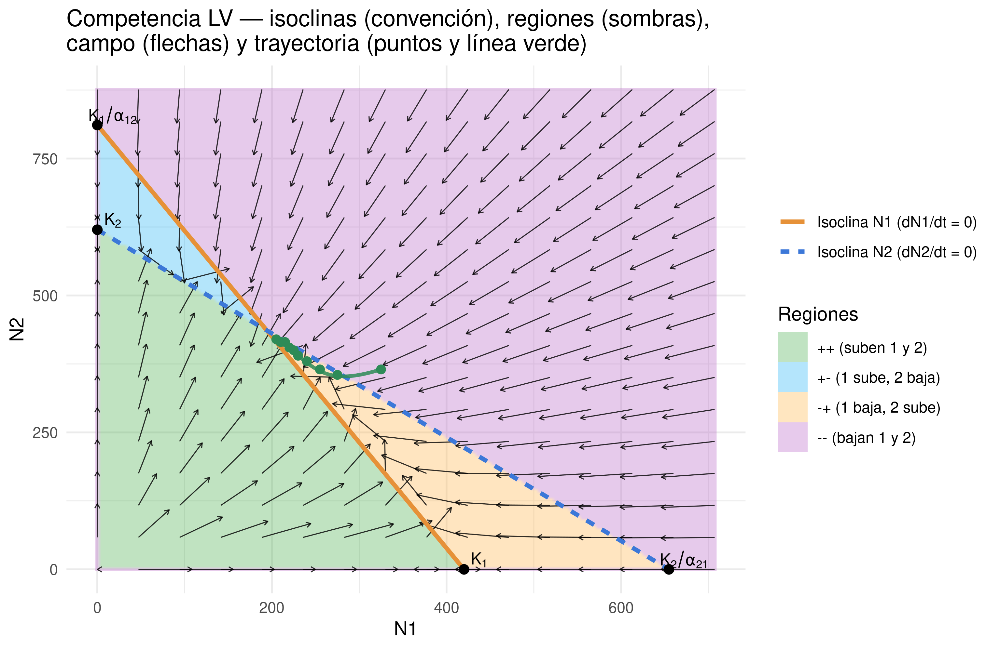

Práctica 2. Interacciones biológicas con **datos de poblaciones**
================
UASD · Arlen Marmolejo Hernández
2025-09-26

<!-- README.md se genera a partir de README.Rmd. Por favor, edita ese archivo. -->
<style type="text/css">
.exp-box summary{
  display:inline-block; cursor:pointer;
  background:#f5f5f5; border:1px solid #ddd;
  padding:.4em .8em; border-radius:.4em; font-weight:600;
}
.exp-box[open] summary{ background:#e8f5e9; border-color:#c8e6c9; }
.exp-box .content{
  margin:.8em 0 0 0; padding:1em;
  border-left:4px solid #2E8B57; background:#fafafa;
}
.exp-box summary .label-open{ display:none; }
.exp-box[open] summary .label-closed{ display:none; }
.exp-box[open] summary .label-open{ display:inline; }
</style>

Versión HTML (quizá más legible),
[aquí](https://ecologia2-master.github.io/practicas/practicas-interacciones-biologicas-dinamica-poblacional/practicas-interacciones-biologicas-dinamica-poblacional.html)

# 1 **Competencia interespecífica** con el modelo de **Lotka–Volterra**

## 1.1 Marco teórico — **Competencia interespecífica** con el modelo de **Lotka–Volterra**

**Fuente base**: *LibreTexts* — *15.5: Quantifying Competition Using the
Lotka-Volterra Model* (Gettysburg College, Ecology for All).

### 1.1.1 Del **logístico** de una especie a la competencia de **dos especies**

Partimos del crecimiento **logístico** para cada especie en ausencia de
la otra (intraespecífica):

$$
\frac{d N_{1}}{dt}=r_{1} N_{1}\left(\frac{K_{1}-N_{1}}{K_{1}}\right),\qquad
\frac{d N_{2}}{dt}=r_{2} N_{2}\left(\frac{K_{2}-N_{2}}{K_{2}}\right).
$$

<!-- NOTA: AÑADIR LOS TÉRMINOS -->

Para incorporar **competencia interespecífica**, suponemos que
individuos de la especie 2 reducen el crecimiento de la 1 en **unidades
equivalentes** a $\alpha_{12}$ individuos de 1 (y viceversa
$\alpha_{21}$). Esto produce las **ecuaciones de Lotka–Volterra
(competencia)**:

$$
\frac{dN_{1}}{dt}= r_{1}N_{1}\!\left(\frac{K_1 - N_{1} - \alpha_{12}N_{2}}{K_{1}}\right),\qquad
\frac{dN_{2}}{dt}= r_{2}N_{2}\!\left(\frac{K_2 - N_{2}-\alpha_{21}N_{1}}{K_{2}}\right).
$$

<!-- NOTA: AÑADIR LOS TÉRMINOS -->

> $\alpha_{12}$ y $\alpha_{21}$ son **coeficientes de competencia**
> (adimensionales): convierten individuos de una especie en
> “**equivalentes**” de la otra en términos de uso de recursos.

<details class="exp-box">
<summary>

<span class="label-closed">Más información</span>
<span class="label-open">Ocultar</span>

</summary>
<div class="content">

Sobre el modelo logístico, construimos el modelo con competencia. Para
ello, incorporamos la competencia interespecífica en cada una de estas
ecuaciones. Suponemos que cada nuevo integrante de la Población 1 reduce
los recursos disponibles para cada integrante de la Población 2 y, por
lo tanto, disminuye su tasa de crecimiento poblacional. Del mismo modo,
los nuevos integrantes de la Población 2 también reducirán los recursos
disponibles para los miembros de la Población 1; eso es, en esencia, lo
que significa competencia interespecífica.

La forma más simple de modelar esto sería modificar el término
correspondiente al efecto de la densidad. Sin embargo, esa opción supone
que cada individuo adicional de la Población 2 afecta a la Población 1
exactamente igual que lo haría un individuo adicional de la propia
Población 1. Como esto no tiene por qué ser cierto, introducimos un
**coeficiente de competencia** que expresa cuánto influye, en términos
relativos, cada individuo adicional de la Población 2 sobre la Población
1 (comparado con el efecto de un individuo adicional de la Población 1).
El modelo para la Población 2 se modifica de manera paralela. El
resultado es el modelo de Lotka–Volterra para competencia entre dos
especies.

Observa los subíndices de los coeficientes de competencia: el que va “de
2 a 1” expresa el efecto de un miembro de la Población 2 sobre la tasa
de crecimiento de la Población 1; el que va “de 1 a 2” expresa el efecto
de un miembro de la Población 1 sobre la tasa de crecimiento de la
Población 2.

El valor del coeficiente de competencia nos dice algo sobre la
importancia relativa de la competencia **interespecífica** frente a la
**intraespecífica** en la dinámica de una especie:

- Si el coeficiente es **menor que 1**, la competencia
  **intraespecífica** tiene un impacto per cápita más fuerte en la
  disponibilidad de recursos para esa especie.

- Si el coeficiente es **mayor que 1**, la competencia
  **interespecífica** tiene un impacto per cápita más fuerte.

- Si el coeficiente es **igual a 1**, ambos tipos de competencia tienen
  un impacto per cápita similar sobre la disponibilidad de recursos para
  esa especie.

  </div>
  </details>

### 1.1.2 **Isoclinas** (líneas de crecimiento cero) y **puntos de equilibrio**

La isoclina de 1 ($dN_1/dt=0$) cumple $N_{1}+\alpha_{12}N_{2}=K_{1}$.  
La de 2 ($dN_2/dt=0$) cumple $N_{2}+\alpha_{21}N_{1}=K_{2}$.

Sus **interceptos** con los ejes son:

- Para 1: $(0,K_1)$ y $(K_1/\alpha_{12},0)$.
- Para 2: $(0,K_2)$ y $(K_2/\alpha_{21},0)$.

El **cruce** de isoclinas da el equilibrio interior $(N_1^{*},N_2^{*})$
cuando existe. La **estabilidad** se evalúa comparando interceptos:

- **1 excluye 2** si $K_1 > K_2/\alpha_{21}$ **y**
  $K_1/\alpha_{12} > K_2$.
- **2 excluye 1** si $K_1 < K_2/\alpha_{21}$ **y**
  $K_1/\alpha_{12} < K_2$.
- **Coexistencia (equilibrio) estable** si $K_1 > K_2/\alpha_{21}$ **y**
  $K_2 > K_1/\alpha_{12}$.
- **Coexistencia (equilibrio) inestable** si $K_1 < K_2/\alpha_{21}$
  **y** $K_2 < K_1/\alpha_{12}$.

**Lectura visual** del plano $N_1$–$N_2$: debajo de la isoclina de una
especie esa especie **crece** ($dN_i/dt>0$); por encima **disminuye**.
Si las flechas del campo apuntan hacia el cruce, hay **coexistencia
estable**; si “caen” a un **eje**, hay **exclusión** (extinción local de
una especie).

> **Figuras (del repo)**  
>  
> 
> 

> **Referencia**: basadas en LibreTexts 15.5 (ver sección
> **Referencias**).

## 1.2 Práctica — **Competencia LV** con datos **pequeños** por estudiante

> **Importante**: Cada estudiante trabaja el **mismo mandato** pero con
> **datos distintos** y **pequeños** (≈10 filas) para poder **hacerlo a
> mano**. Se generan a partir de un **pseudónimo** (“Est01”, “Est02”,
> …).

### 1.2.1 Preparación y **pseudónimo**

``` r
# Paquetes usados
suppressPackageStartupMessages({
  library(ggplot2)
  library(digest)
})

# Lista ejemplo (puedes sustituir por la de clase)
if (!exists("pseudonimos_clase")){
  pseudonimos_clase <- paste0("Est", sprintf("%02d", 1:30))
}
```

``` r
cat("Pseudónimos: ", paste(pseudonimos_clase[-1], collapse=", "), "\n")
```

Pseudónimos: Est02, Est03, Est04, Est05, Est06, Est07, Est08, Est09,
Est10, Est11, Est12, Est13, Est14, Est15, Est16, Est17, Est18, Est19,
Est20, Est21, Est22, Est23, Est24, Est25, Est26, Est27, Est28, Est29,
Est30

``` r
# Elige tu pseudónimo
MI_PSEUDONIMO <- "Est01"  # <-- CAMBIA AQUÍ
```

### 1.2.2 Generador **reproducible** (tabla pequeña + trayectoria)

``` r
seed_from_name <- function(x){
  # hash a 32 bits reproducible
  hx <- tryCatch(digest::digest(x, algo="xxhash64", serialize=FALSE),
                 error=function(e) digest::digest(x, algo="crc32", serialize=FALSE))
  by <- vapply(seq(1, 8, 2), function(i) strtoi(substr(hx, i, i+1), 16L), numeric(1))
  u32 <- sum(by * c(1,256,65536,16777216))
  as.integer(1 + (u32 %% (.Machine$integer.max - 1)))
}

# Generador competencia LV con tabla pequeña (~10 filas) para trazo a mano
gen_competencia_lv <- function(seed, steps_small=10, steps_traj=300, dt=0.05){
  set.seed(seed + 501)
  K1 <- sample(seq(320, 680, by=20), 1)
  K2 <- sample(seq(280, 640, by=20), 1)
  r1 <- runif(1, 0.35, 0.9)
  r2 <- runif(1, 0.35, 0.9)
  a12 <- runif(1, 0.2, 1.1)
  a21 <- runif(1, 0.2, 1.1)

  # Forzar 4 escenarios variados según semilla
  caso <- (seed %% 4) + 1
  if (caso == 1){ a12 <- max(0.2, a12 * 0.8); a21 <- min(1.1, a21 * 1.2) }      # 1 excluye 2
  if (caso == 2){ a12 <- min(1.1, a12 * 1.2); a21 <- max(0.2, a21 * 0.8) }      # 2 excluye 1
  if (caso == 3){ a12 <- a12 * 0.95; a21 <- a21 * 0.95 }                         # coexistencia estable
  if (caso == 4){ a12 <- a12 * 1.05; a21 <- a21 * 1.05 }                         # coexistencia inestable

  euler <- function(N10,N20,steps,dt){
    N1 <- N2 <- numeric(steps); N1[1] <- N10; N2[1] <- N20
    for (t in 2:steps){
      dN1 <- r1*N1[t-1]*(1 - (N1[t-1] + a12*N2[t-1])/K1)
      dN2 <- r2*N2[t-1]*(1 - (N2[t-1] + a21*N1[t-1])/K2)
      N1[t] <- max(0, N1[t-1] + dN1*dt)
      N2[t] <- max(0, N2[t-1] + dN2*dt)
    }
    data.frame(t = 0:(steps-1)*dt, N1=N1, N2=N2)
  }

  N10 <- round(runif(1, 0.15, 0.85)*K1)
  N20 <- round(runif(1, 0.15, 0.85)*K2)
  traj <- euler(N10, N20, steps_traj, dt)

  # Submuestreo para tabla pequeña (~10 puntos) y redondeo “a mano”
  take <- unique(round(seq(1, nrow(traj), length.out = steps_small)))
  small <- traj[take, c("t","N1","N2")]
  rnd5 <- function(x) 5*round(x/5)
  small$N1 <- rnd5(small$N1); small$N2 <- rnd5(small$N2)

  pars <- c(r1=r1,r2=r2,K1=K1,K2=K2,a12=a12,a21=a21,caso=caso,N10=N10,N20=N20)
  list(data_traj=traj, data_small=small, pars=pars)
}

SEED <- seed_from_name(MI_PSEUDONIMO)
comp <- gen_competencia_lv(SEED)
```

### 1.2.3 **Tu tabla pequeña** y parámetros (para trabajar **a mano**)

``` r
knitr::kable(comp$data_small, row.names = F,
             caption="Competencia LV — tabla pequeña (≈10 filas) para graficar a mano")
```

|     t |  N1 |  N2 |
|------:|----:|----:|
|  0.00 | 325 | 365 |
|  1.65 | 275 | 355 |
|  3.30 | 255 | 365 |
|  5.00 | 240 | 380 |
|  6.65 | 230 | 390 |
|  8.30 | 225 | 400 |
|  9.95 | 220 | 405 |
| 11.65 | 215 | 415 |
| 13.30 | 210 | 415 |
| 14.95 | 205 | 420 |

<span id="tab:tabla-pequena"></span>Table 1.1: Competencia LV — tabla
pequeña (≈10 filas) para graficar a mano

``` r
knitr::kable(as.data.frame(comp$pars),
             caption="Competencia LV — parámetros",
             col.names=c("Parámetro","Valor"))
```

| Parámetro |       Valor |
|:----------|------------:|
| r1        |   0.7362978 |
| r2        |   0.8315835 |
| K1        | 420.0000000 |
| K2        | 620.0000000 |
| a12       |   0.5178140 |
| a21       |   0.9469748 |
| caso      |   3.0000000 |
| N10       | 327.0000000 |
| N20       | 366.0000000 |

<span id="tab:tabla-pequena"></span>Table 1.1: Competencia LV —
parámetros

### 1.2.4 **Mandatos (entregables a mano)**

1.  **Calcula** los **interceptos** de las isoclinas y **anótalos** (1
    decimal):
    - Isoclina de 1: $(0,K_1)$ y $(K_1/\alpha_{12},0)$.
    - Isoclina de 2: $(0,K_2)$ y $(K_2/\alpha_{21},0)$.
2.  **Dibuja a mano** ambas isoclinas en el plano $N_1$–$N_2$ y
    **sombrea** las 4 regiones por signos de $(dN_1/dt,\ dN_2/dt)$:
    `++`, `+-`, `-+`, `--`.
3.  **Coloca** los ≈10 puntos $(N_1,N_2)$ de tu tabla (en orden de $t$)
    y **traza** la trayectoria.
4.  **Diagnostica** el resultado (**coexistencia estable / inestable /
    exclusión 1 / exclusión 2**) **argumentando** con los interceptos y
    el sombreado.
5.  **Verifica** “a mano” el **signo** de $dN_1/dt$ y $dN_2/dt$ en un
    punto de **cada región** (elige $(n_1,n_2)$ de referencia y evalúa
    los signos).

### 1.2.5 **Demostración manual, usando datos de *Est01***

> Objetivo: reproducir **a mano** (o con **Excel**) lo pedido en los
> **Mandatos** de competencia LV, **sin usar R**. Usa **tu tabla
> pequeña** (≈10 filas) y tu **tabla de parámetros** (con
> $K_1,K_2,r_1,r_2,\alpha_{12},\alpha_{21}$) que ya aparecen arriba para
> *Est01*.

**Parámetros de *Est01***
$r_1=0.7363,\; r_2=0.8316,\; K_1=420,\; K_2=620,\; \alpha_{12}=0.517814,\; \alpha_{21}=0.9469748$

#### 1.2.5.1 **Calcula los interceptos** de las isoclinas (anota a 1 decimal)

Modelo LV de competencia:

$$
\frac{dN_1}{dt}=r_1N_1\!\left(\frac{K_1 - N_1 - \alpha_{12}N_2}{K_1}\right),\qquad
\frac{dN_2}{dt}=r_2N_2\!\left(\frac{K_2 - N_2 - \alpha_{21}N_1}{K_2}\right).
$$

Isoclinas (líneas de crecimiento cero):

- **Isoclina de 1** ($dN_1/dt=0$): $N_1=K_1-\alpha_{12}N_2$ Interceptos:
  $(K_1,0)=(\mathbf{420.0},0)$ y
  $(0,K_1/\alpha_{12})=(0,\mathbf{811.1})$ (cálculo:
  $420/0.517814=811.102\rightarrow \mathbf{811.1}$)
- **Isoclina de 2** ($dN_2/dt=0$): $N_2=K_2-\alpha_{21}N_1$ Interceptos:
  $(0,K_2)=(0,\mathbf{620.0})$ y
  $(K_2/\alpha_{21},0)=(\mathbf{654.7},0)$ (cálculo:
  $620/0.9469748=654.716\rightarrow \mathbf{654.7}$)

**En Excel (opcional):** con celdas `K1=420`, `K2=620`, `a12=0.517814`,
`a21=0.9469748` `=K1/a12` → **811.1**;   `=K2/a21` → **654.7**.

#### 1.2.5.2 **Fija escalas de ejes** para que entren todos los interceptos

Usa límites algo superiores al mayor intercepto de cada eje:

- Horizontal
  $x_{\max}\approx 1.1\times \max(K_1,\;K_2/\alpha_{21})=1.1\times 654.7\approx \mathbf{720}$.
- Vertical
  $y_{\max}\approx 1.1\times \max(K_2,\;K_1/\alpha_{12})=1.1\times 811.1\approx \mathbf{900}$.

Traza ejes $N_1$ (0…720) y $N_2$ (0…900). Rejilla cómoda: pasos de 50.

#### 1.2.5.3 **Dibuja las isoclinas** con regla (o con Dispersión en Excel)

- **Isoclina N1** (**sólida**, p.ej. naranja): une $(\mathbf{420},0)$
  con $(0,\mathbf{811.1})$. Etiqueta: *Isoclina N1 (dN1/dt = 0)*.
- **Isoclina N2** (**punteada**, p.ej. azul): une $(0,\mathbf{620})$ con
  $(\mathbf{654.7},0)$. Etiqueta: *Isoclina N2 (dN2/dt = 0)*.

**En Excel:** crea dos series con esos dos puntos por línea → Gráfico de
**Dispersión con líneas**. Formatea N1 **sólida** y N2 **discontinua**.

#### 1.2.5.4 **Sombréa las 4 regiones** por signos de $(dN_1/dt,\ dN_2/dt)$

Regla memotécnica: **debajo** de una isoclina esa especie **crece**;
**encima**, **disminuye**.

- Debajo de ambas → **`++`** (suben 1 y 2).
- Debajo de N1 y **encima** de N2 → **`+-`** (1 sube, 2 baja).
- **Encima** de N1 y debajo de N2 → **`-+`** (1 baja, 2 sube).
- Encima de ambas → **`--`** (bajan 1 y 2).

Sombrea suavemente o escribe los símbolos en cada zona.

#### 1.2.5.5 **Traza tu trayectoria** con la **tabla pequeña** de Est01

Tus ≈10 puntos $(N_1,N_2)$:

$$
(325,365)\to(275,355)\to(255,365)\to\cdots\to(205,420)
$$

Colócalos en orden de $t$ y **únelos con flechas** para indicar el
sentido temporal.

> Observación de Est01: del primer al segundo punto $N_1\downarrow$ y
> $N_2\downarrow$ (zona `--`), luego $N_1\downarrow$ y $N_2\uparrow$
> (zona `-+`), con flechas **hacia arriba–izquierda** (tendencia al eje
> $N_1=0$).

#### 1.2.5.6 **Verificación numérica “a mano”** del **signo** en 4 puntos

Evalúa el paréntesis de cada derivada (no necesitas los valores
exactos):

$$
dN_1/dt\propto\Big(1-\frac{N_1+\alpha_{12}N_2}{K_1}\Big),\qquad
dN_2/dt\propto\Big(1-\frac{N_2+\alpha_{21}N_1}{K_2}\Big).
$$

Ejemplos con *Est01*
($\alpha_{12}=0.517814,\ \alpha_{21}=0.9469748,\ K_1=420,\ K_2=620$):

- **`++`** en $(100,100)$:
  $100+0.5178\cdot100=151.8<420\Rightarrow dN_1>0$;
  $100+0.9470\cdot100=194.7<620\Rightarrow dN_2>0$.
- **`+-`** en $(100,540)$:
  $100+0.5178\cdot540=379.6<420\Rightarrow dN_1>0$;
  $540+0.9470\cdot100=634.7>620\Rightarrow dN_2<0$.
- **`-+`** en $(400,100)$:
  $400+0.5178\cdot100=451.8>420\Rightarrow dN_1<0$;
  $100+0.9470\cdot400=478.8<620\Rightarrow dN_2>0$.
- **`--`** en $(500,600)$:
  $500+0.5178\cdot600=810.7>420\Rightarrow dN_1<0$;
  $600+0.9470\cdot500=1073.5>620\Rightarrow dN_2<0$.

#### 1.2.5.7 **Diagnóstico por interceptos** (casos clásicos) con números de Est01

Compara:

- $K_1\stackrel{?}{>}K_2/\alpha_{21}$ → $420\stackrel{?}{>}654.7$ →
  **FALSO**.
- $K_1/\alpha_{12}\stackrel{?}{>}K_2$ → $811.1\stackrel{?}{>}620$ →
  **VERDADERO**.

Patrón (**FALSO**, **VERDADERO**) ⇒ **coexistencia inestable** (*punto
silla*, **efecto de prioridad**).

> Con las **condiciones iniciales** de Est01
> $(N_{1,0}\approx327,\ N_{2,0}\approx366)$, los primeros puntos caen en
> `--` y luego en `-+` (flechas hacia **arriba–izquierda**), lo que
> **sugiere** que la trayectoria se dirige hacia el **eje $N_1=0$** ⇒
> **2 excluye a 1** en este montaje (coherente con “coexistencia
> inestable”: el resultado depende del lado del separador donde caiga el
> estado inicial).

*(Opcional)* Cruce de isoclinas (equilibrio interior):

$$
N_1^*=\frac{K_1-\alpha_{12}K_2}{1-\alpha_{12}\alpha_{21}}=\mathbf{194.2},\quad
N_2^*=\frac{K_2-\alpha_{21}K_1}{1-\alpha_{12}\alpha_{21}}=\mathbf{436.1}
$$

(existe, pero es **inestable** con estos parámetros).

#### 1.2.5.8 **Redacción corta** (modelo de respuesta)

- **Interceptos**: $(420,0),\ (0,811.1),\ (0,620),\ (654.7,0)$.
- **Gráfico**: N1 **sólida**, N2 **punteada**; zonas `++`, `+-`, `-+`,
  `--`; trayectoria con flechas.
- **Diagnóstico**: por desigualdades → **coexistencia inestable**; con
  mis iniciales, **2 excluye a 1**.
- **Interpretación ecológica**: bajo condiciones constantes, 2
  **reduce** a 1 hasta densidad $\approx0$ (extinción **local**); 1
  podría persistir en otro hábitat o volver por inmigración.

#### 1.2.5.9 **Errores comunes** (revísalos antes de entregar)

- Dibujar la **isoclina N1** usando $(0,K_1)$ en vez de
  $(0,K_1/\alpha_{12})$.
- Elegir límites de ejes **demasiado cortos** que **cortan** los
  interceptos.
- No seguir el **orden temporal** al unir los puntos de la trayectoria.
- Concluir “no hay cruce” por mala escala: **las rectas siempre se
  cruzan**; lo que cambia es la **estabilidad**.

<!-- ### **Demostración manual, usando datos de *Est01*** -->
<!-- > Objetivo: reproducir **a mano** (o con **Excel**) lo pedido en los **Mandatos** de competencia LV, **sin usar R**. Usa **tu tabla pequeña** (≈10 filas) y tu **tabla de parámetros** (con $K_1,K_2,r_1,r_2,\alpha_{12},\alpha_{21}$) que ya aparecen arriba para *Est01*. -->
<!-- --- -->
<!-- #### Material y preparación -->
<!-- * Hoja cuadriculada (opcional), o Excel/Google Sheets. -->
<!-- * Regla, lápiz, borrador y **colores** (dos para las isoclinas; uno para la trayectoria). -->
<!-- * Copia en la parte superior de la hoja (o en celdas de Excel) **estos seis parámetros**: -->
<!--   $K_1, K_2, r_1, r_2, \alpha_{12}, \alpha_{21}$. -->
<!-- --- -->
<!-- #### **Calcula los interceptos** de las isoclinas (1 decimal) -->
<!-- Modelo LV de competencia: -->
<!-- $$ -->
<!-- \frac{dN_1}{dt}=r_1N_1\!\left(\frac{K_1 - N_1 - \alpha_{12}N_2}{K_1}\right), -->
<!-- \qquad -->
<!-- \frac{dN_2}{dt}=r_2N_2\!\left(\frac{K_2 - N_2 - \alpha_{21}N_1}{K_2}\right). -->
<!-- $$ -->
<!-- Isoclinas (líneas de crecimiento cero): -->
<!-- * **Isoclina de 1 (d$N_1$/dt = 0):** $N_1=\;K_1-\alpha_{12}N_2$ -->
<!--   **Interceptos:** $(K_1,\,0)$ en el eje **$N_1$** y $(0,\,K_1/\alpha_{12})$ en el eje **$N_2$**. -->
<!-- * **Isoclina de 2 (d$N_2$/dt = 0):** $N_2=\;K_2-\alpha_{21}N_1$ -->
<!--   **Interceptos:** $(0,\,K_2)$ en el eje **$N_2$** y $(K_2/\alpha_{21},\,0)$ en el eje **$N_1$**. -->
<!-- **En Excel (opcional):** -->
<!-- * En celdas con nombres/etiquetas `K1`, `K2`, `a12`, `a21`, escribe: -->
<!--   * `=K1/a12`  → $K_1/\alpha_{12}$ -->
<!--   * `=K2/a21`  → $K_2/\alpha_{21}$ -->
<!-- Redondea a **1 decimal** para anotar en el dibujo. -->
<!-- --- -->
<!-- #### **Define las escalas** de los ejes antes de dibujar -->
<!-- Para que **siempre entren los cuatro interceptos**, usa: -->
<!-- * Límite horizontal $x_{\max} \approx 1{.}1 \times \max\big(K_1,\;K_2/\alpha_{21}\big)$. -->
<!-- * Límite vertical $y_{\max} \approx 1{.}1 \times \max\big(K_2,\;K_1/\alpha_{12}\big)$. -->
<!-- Marca los ejes $N_1$ (horizontal) y $N_2$ (vertical) desde 0 hasta esos límites con una **grilla cómoda** (p. ej., pasos de 50). -->
<!-- --- -->
<!-- #### **Traza las isoclinas** con regla (o con Dispersión en Excel) -->
<!-- * **Isoclina N1 (sólida, p. ej. naranja):** une los puntos $(K_1,0)$ y $(0, K_1/\alpha_{12})$. -->
<!--   Etiqueta cerca de la línea: *“Isoclina N1 (dN1/dt = 0)”*. -->
<!-- * **Isoclina N2 (punteada, p. ej. azul):** une $(0,K_2)$ y $(K_2/\alpha_{21},0)$. -->
<!--   Etiqueta: *“Isoclina N2 (dN2/dt = 0)”*. -->
<!-- **En Excel:** -->
<!-- 1. Crea una tabla con cuatro filas, dos por cada recta: -->
<!--    * Serie **Isoclina N1**: `x = K1, y = 0` y `x = 0, y = K1/a12`. -->
<!--    * Serie **Isoclina N2**: `x = 0, y = K2` y `x = K2/a21, y = 0`. -->
<!-- 2. Inserta **Gráfico de dispersión (XY)** con líneas rectas. -->
<!-- 3. Formato de series: N1 **línea sólida**; N2 **línea discontinua**. -->
<!-- --- -->
<!-- #### **Sombréa las 4 regiones** por signos de $(dN_1/dt,\ dN_2/dt)$ -->
<!-- Regla memotécnica (vale tanto en papel como en Excel): -->
<!-- * **Debajo** de cada isoclina, esa especie **crece**. **Encima**, **disminuye**. -->
<!-- * Por tanto: -->
<!--   * Debajo de **ambas** → `++` (suben 1 y 2). -->
<!--   * Debajo de N1 y **encima** de N2 → `+-` (1 sube, 2 baja). -->
<!--   * **Encima** de N1 y debajo de N2 → `-+` (1 baja, 2 sube). -->
<!--   * **Encima** de ambas → `--` (bajan 1 y 2). -->
<!-- Sombrea **suavemente** cada zona con un color distinto (o añade etiquetas `++`, `+-`, `-+`, `--`). -->
<!-- --- -->
<!-- #### **Trazado de tu trayectoria** con la **tabla pequeña** (≈10 filas) -->
<!-- * Toma tus ~10 pares $(N_1,N_2)$ (colúmnas **N1** y **N2**). -->
<!--   En papel: coloca **punto por punto** y **únelos con flechas** siguiendo el **orden temporal**. -->
<!--   En Excel: agrega esa tabla como **tercera serie** (línea con marcadores) y **ordénala** por `t`. -->
<!-- **Consejo:** añade **flechas** en 2–3 tramos para indicar el **sentido temporal**. -->
<!-- --- -->
<!-- #### **Verificación numérica “a mano”** del signo en 4 puntos -->
<!-- Elige un punto representativo en cada región (por ejemplo, un cruce de la grilla). Calcula los **signos** de: -->
<!-- $$ -->
<!-- dN_1/dt=r_1N_1\Big(1-\frac{N_1+\alpha_{12}N_2}{K_1}\Big),\qquad -->
<!-- dN_2/dt=r_2N_2\Big(1-\frac{N_2+\alpha_{21}N_1}{K_2}\Big). -->
<!-- $$ -->
<!-- No necesitas el valor exacto, **solo el signo** (+/−). Basta con evaluar el paréntesis: -->
<!-- * Si $N_1+\alpha_{12}N_2<K_1$ ⇒ $dN_1/dt>0$. -->
<!-- * Si $N_2+\alpha_{21}N_1<K_2$ ⇒ $dN_2/dt>0$. -->
<!-- **En Excel:** con $n_1$ en `A2` y $n_2$ en `B2`, y con parámetros en celdas `K1`,`K2`,`r1`,`r2`,`a12`,`a21`: -->
<!-- * `=r1*A2*(1 - (A2 + a12*B2)/K1)` → valor de $dN_1/dt$. -->
<!-- * `=r2*B2*(1 - (B2 + a21*A2)/K2)` → valor de $dN_2/dt$. -->
<!-- * Muestra el **signo** con `=IF(C2>0,"+","-")` (ajusta separadores `,`/`;` según tu configuración regional). -->
<!-- --- -->
<!-- #### **Diagnóstico** por **interceptos** (casos clásicos) -->
<!-- Compara **dos desigualdades**: -->
<!-- * $K_1 \stackrel{?}{>} K_2/\alpha_{21}$  y  $K_1/\alpha_{12} \stackrel{?}{>} K_2$. -->
<!-- Conclusión: -->
<!-- * **1 excluye 2** si **ambas** son **verdaderas**. -->
<!-- * **2 excluye 1** si **ambas** son **falsas**. -->
<!-- * **Coexistencia estable** si la **primera es verdadera** y la **segunda falsa**. -->
<!-- * **Coexistencia inestable** si la **primera es falsa** y la **segunda verdadera**. -->
<!-- **En Excel (texto automático):** -->
<!-- ```text -->
<!-- =IF(AND(K1>K2/a21, K1/a12>K2), "1 excluye 2", -->
<!--   IF(AND(K1<=K2/a21, K1/a12<=K2), "2 excluye 1", -->
<!--     IF(AND(K1>K2/a21, K1/a12<=K2), "Coexistencia estable", -->
<!--        "Coexistencia inestable"))) -->
<!-- ``` -->
<!-- (Ajusta `,` por `;` si tu Excel lo requiere.) -->
<!-- --- -->
<!-- #### **Redacción corta** de resultados (para entregar) -->
<!-- 1. **Interceptos:** anota $(K_1,0), (0,K_1/\alpha_{12}), (0,K_2), (K_2/\alpha_{21},0)$. -->
<!-- 2. **Gráfico:** incluye las dos isoclinas con **convención** (N1 **sólida**, N2 **punteada**), **regiones** y **trayectoria**. -->
<!-- 3. **Verificación:** tabla con 4 puntos y signos $(dN_1/dt,\ dN_2/dt)$. -->
<!-- 4. **Diagnóstico final** (una línea): “**Resultado:** … (justifica con interceptos y regiones)”. -->
<!-- 5. **Interpretación ecológica (3–5 líneas):** explica **quién excluye a quién** (si aplica) o por qué **coexisten**. -->
<!-- --- -->
<!-- #### **Errores comunes** (revísalos antes de entregar) -->
<!-- * Dibujar la **isoclina N1** usando $(0,K_1)$ en vez de $(0,K_1/\alpha_{12})$. -->
<!-- * Elegir límites de ejes **demasiado cortos** que **cortan** los interceptos. -->
<!-- * No seguir el **orden temporal** al unir los puntos de la trayectoria. -->
<!-- * Concluir “no hay cruce” por mala escala: **las rectas siempre se cruzan**; lo que cambia es la **estabilidad**. -->

### 1.2.6 **Demostración con R usando datos de *Est01*** (puedes aplicarlo a tu caso también)

``` r
pars <- comp$pars
K1 <- pars["K1"]; K2 <- pars["K2"]; a12 <- pars["a12"]; a21 <- pars["a21"]; r1 <- pars["r1"]; r2 <- pars["r2"]

int_N1_x <- K1/a12
int_N1_y <- K1
int_N2_x <- K2/a21
int_N2_y <- K2

cat(sprintf("Interceptos calculados:\n  Isoclina N1: (0, %.1f) y (%.1f, 0)\n  Isoclina N2: (0, %.1f) y (%.1f, 0)\n",
            int_N1_y, int_N1_x, int_N2_y, int_N2_x))
```

Interceptos calculados: Isoclina N1: (0, 420.0) y (811.1, 0) Isoclina
N2: (0, 620.0) y (654.7, 0)

``` r
# Diagnóstico por desigualdades (teórico)
c1 <- (K1 >  K2 / a21) && (K1 / a12 > K2)
c2 <- (K1 <  K2 / a21) && (K1 / a12 < K2)
c3 <- (K1 >  K2 / a21) && (K2 >  K1 / a12)
c4 <- (K1 <  K2 / a21) && (K2 <  K1 / a12)
diag <- if (c1) "1 excluye 2" else if (c2) "2 excluye 1" else if (c3) "coexistencia estable" else if (c4) "coexistencia inestable" else "indeterminado"
cat("Diagnóstico teórico por interceptos:", diag, "\n")
```

Diagnóstico teórico por interceptos: coexistencia inestable

### 1.2.7 Gráfico interpretativo (**sombras + flechas + trayectoria**)

``` r
# --- Interceptos correctos y límites adecuados ---

# Interceptos por isoclina
# N1-iso: N1 = K1 - a12*N2  ->  (x = K1, y = 0) y (x = 0, y = K1/a12)
xint_N1iso <- K1
yint_N1iso <- K1 / a12

# N2-iso: N2 = K2 - a21*N1 ->  (x = K2/a21, y = 0) y (x = 0, y = K2)
xint_N2iso <- K2 / a21
yint_N2iso <- K2

# Límites que siempre muestren TODOS los interceptos
x_max <- 1.08 * max(xint_N1iso, xint_N2iso, na.rm = TRUE)
y_max <- 1.08 * max(yint_N1iso, yint_N2iso, na.rm = TRUE)

# Malla para sombreado de regiones por signos
nx <- 160; ny <- 160
grid <- expand.grid(N1 = seq(0, x_max, length.out = nx),
                    N2 = seq(0, y_max, length.out = ny))
grid$dN1 <- r1*grid$N1*(1 - (grid$N1 + a12*grid$N2)/K1)
grid$dN2 <- r2*grid$N2*(1 - (grid$N2 + a21*grid$N1)/K2)
grid$region <- with(grid,
  ifelse(dN1>0 & dN2>0, "++ (suben 1 y 2)",
  ifelse(dN1>0 & dN2<0, "+- (1 sube, 2 baja)",
  ifelse(dN1<0 & dN2>0, "-+ (1 baja, 2 sube)",
                     "-- (bajan 1 y 2)"))))
grid$region <- factor(grid$region,
  levels = c("++ (suben 1 y 2)","+- (1 sube, 2 baja)",
             "-+ (1 baja, 2 sube)","-- (bajan 1 y 2)"))

# Campo de vectores (flechas)
gd <- expand.grid(N1 = seq(0, x_max, length.out = 16),
                  N2 = seq(0, y_max, length.out = 16))
gd$dN1 <- r1*gd$N1*(1 - (gd$N1 + a12*gd$N2)/K1)
gd$dN2 <- r2*gd$N2*(1 - (gd$N2 + a21*gd$N1)/K2)
L <- sqrt(gd$dN1^2 + gd$dN2^2); L[L==0] <- 1e-9
gd$u1 <- gd$dN1/L; gd$u2 <- gd$dN2/L
arrow_len <- 0.07 * max(x_max, y_max)
gd$xend <- gd$N1 + arrow_len*gd$u1
gd$yend <- gd$N2 + arrow_len*gd$u2

# Isoclinas trazadas SOLO entre sus interceptos
# N2-iso: variar N1 de 0 a xint_N2iso
n1_seg <- seq(0, xint_N2iso, length.out = 500)
n2_iso <- K2 - a21*n1_seg

# N1-iso: variar N2 de 0 a yint_N1iso
n2_seg <- seq(0, yint_N1iso, length.out = 500)
n1_iso <- K1 - a12*n2_seg

df_iso <- rbind(
  data.frame(N1 = n1_iso, N2 = n2_seg,
             iso = "Isoclina N1 (dN1/dt = 0)"),
  data.frame(N1 = n1_seg, N2 = n2_iso,
             iso = "Isoclina N2 (dN2/dt = 0)")
)

# Puntos y etiquetas de interceptos (en el eje correcto)
pts_iso <- data.frame(
  N1  = c(xint_N1iso, 0,            0,           xint_N2iso),
  N2  = c(0,          yint_N1iso,   yint_N2iso,  0),
  lab = c("K[1]", "K[1]/alpha[12]", "K[2]", "K[2]/alpha[21]")
)

# Gráfico
ggplot() +
  geom_raster(data = grid, aes(N1, N2, fill = region),
              alpha = 0.35, interpolate = TRUE) +
  scale_fill_manual(values = c("++ (suben 1 y 2)" = "#4CAF50",
                               "+- (1 sube, 2 baja)" = "#29B6F6",
                               "-+ (1 baja, 2 sube)" = "#FFB74D",
                               "-- (bajan 1 y 2)" = "#BA68C8"),
                    name = "Regiones") +
  geom_segment(data = gd, aes(x = N1, y = N2, xend = xend, yend = yend),
               arrow = arrow(length = grid::unit(3,"pt")),
               linewidth = 0.3, alpha = 0.8) +
  geom_path(data = df_iso, aes(N1, N2, color = iso, linetype = iso),
            linewidth = 1.2) +
  scale_color_manual(values = c("Isoclina N1 (dN1/dt = 0)" = "#E69138",  # naranja sólida
                                "Isoclina N2 (dN2/dt = 0)" = "#3C78D8"), # azul punteada
                     name = NULL) +
  scale_linetype_manual(values = c("Isoclina N1 (dN1/dt = 0)" = "solid",
                                   "Isoclina N2 (dN2/dt = 0)" = "22"),
                        name = NULL) +
  geom_point(data = pts_iso, aes(N1, N2), size = 2.2) +
  geom_text(data = pts_iso, aes(N1, N2, label = lab), parse = TRUE,
            nudge_x = 0.02*max(x_max,y_max),
            nudge_y = 0.02*max(x_max,y_max),
            size = 3.3) +
  geom_point(data = comp$data_small, aes(N1, N2), color = "#2E8B57", size = 2) +
  geom_path (data = comp$data_traj,  aes(N1, N2), color = "#2E8B57",
             linewidth = 1.0, alpha = 0.85) +
  coord_cartesian(xlim = c(0, x_max), ylim = c(0, y_max), expand = TRUE) +
  labs(title = "Competencia LV — isoclinas (convención), regiones (sombras), campo (flechas) y trayectoria",
       x = "N1", y = "N2") +
  theme_minimal() +
  theme(legend.position = "right",
        legend.box.margin = margin(t = 2, r = 2, b = 2, l = 2))
```



> **Figuras complementarias (del repo)**  
> 

## 1.3 **Exclusión competitiva** — texto guía para interpretar

> **Definición operativa**: **exclusión competitiva** significa que,
> bajo condiciones constantes, **una especie reduce a la otra hasta
> densidad ≈ 0 en esa comunidad** (*extinción local*). Coloquialmente:
> “**1 saca a 2 del sitio**”. No implica extinción global; la especie
> excluida puede persistir en otro hábitat o volver por inmigración.

En el **modelo de Lotka–Volterra**:

- Decimos **“1 excluye a 2”** cuando la trayectoria termina en
  $(K_1,0)$: la población 2 cae al **eje $N_2=0$** y no se recupera.
- **Lectura del plano $N_1$–$N_2$**: si las **flechas** del campo llevan
  hacia el eje $N_2=0$, **2 se extingue localmente**; si llevan al eje
  $N_1=0$, la excluida es **1**; si llevan al **cruce de isoclinas**,
  hay **coexistencia**.

**Cuándo pasa**: cuando la **competencia interespecífica** sobre la
especie perdedora es tan fuerte que su crecimiento es **negativo**
frente a la otra, incluso a bajas densidades.  
**Cuándo no**: con **partición de nicho**, **variación ambiental**,
**heterogeneidad espacial** o **rescate por inmigración**, la
coexistencia puede mantenerse.

------------------------------------------------------------------------

# 2 **Depredador–presa (LV)** — *con tus datos*

## 2.1 Datos

``` r
# Depredador–presa LV: presa (N) y depredador (P)
gen_predpresa_lv <- function(seed, tmax=150, by=0.2){
  set.seed(seed + 602)
  r <- runif(1, 0.3, 1.1)
  a <- runif(1, 0.006, 0.02)
  b <- runif(1, 0.06, 0.2)
  m <- runif(1, 0.25, 0.9)
  N0 <- sample(20:80, 1)
  P0 <- sample(6:20, 1)
  pars <- c(r=r, a=a, b=b, m=m)
  tt <- seq(0, tmax, by=by)
  lv <- function(t, y, p){
    N <- y[1]; P <- y[2]
    with(as.list(p), {
      dN <- r*N - a*N*P
      dP <- b*a*N*P - m*P
      list(c(dN, dP))
    })
  }
  out <- as.data.frame(ode(y=c(N=N0, P=P0), times=tt, func=lv, parms=pars))
  pars2 <- c(pars, N0=N0, P0=P0, N_star=m/(b*a), P_star=r/a)
  list(data=out, pars=pars2)
}

# Construye datos para MI_PSEUDONIMO
pp   <- gen_predpresa_lv(SEED)
```

## 2.2 **A mano** (entregable)

1.  Con tus parámetros $r,a,b,m$ calcula $N^*=\frac{m}{ba}$,
    $P^*=\frac{r}{a}$.  
2.  Dibuja las **nullclines** (líneas de crecimiento cero) en el plano
    $N$–$P$.  
3.  Señala la dirección cualitativa del campo de vectores en 4 regiones.

## 2.3 **En R**: series y plano de fase

``` r
pp_dat <- pp$data; pp_par <- pp$pars
Nstar <- pp_par["N_star"]; Pstar <- pp_par["P_star"]

par(mfrow=c(1,2))
plot(pp_dat$time, pp_dat$N, type="l", xlab="t", ylab="N (presa)", main="Serie temporal (presa)")
plot(pp_dat$N, pp_dat$P, type="l", xlab="N", ylab="P", main="Plano de fase")
abline(v = Nstar, h = Pstar, lty=2)
```


``` r
par(mfrow=c(1,1))
pp_par[c("r","a","b","m","N_star","P_star")]
```

    ##            r            a            b            m       N_star       P_star 
    ##   0.64442893   0.01133067   0.12625733   0.69500409 485.81962602  56.87472534

**Interpretación**: cómo cambian amplitudes/períodos cuando
aumentan/disminuyen $a,b,m$; relación de fase (pico de $N$ precede a
$P$).

# 3 Referencias

- *LibreTexts*: **15.5: Quantifying Competition Using the Lotka–Volterra
  Model** (Gettysburg College, *Ecology for All*). Licencia **CC
  BY-NC-SA**. URL:
  <https://bio.libretexts.org/Courses/Gettysburg_College/01%3A_Ecology_for_All/15%3A_Competition/15.05%3A_Quantifying_Competition_Using_the_Lotka-Volterra_Model>
